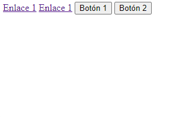
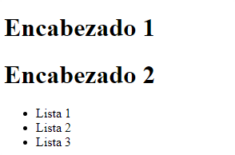

<h1 align=center>Elementos en línea y Bloque</h1>
<hr>

## Contenido:

- Introducción.
- Elementos en línea.
- Elementos en bloque.

<hr>

### -Introducción

Para poder estructurar la pagina es muy importante conocer el comportamiento de los elementos y como se colocan de forma predeterminada en el navegador. Saber el espacio que ocupa un elemento no es solo importante para el HTML, también es importante al aplicar estilos mediante CSS. Para saber si un elemento es de tipo bloque o línea es necesario fijarse en la etiqueta.

> **Todos las etiquetas se dividen en dos grupos. Etiquetas de línea y Etiquetas de bloque.**

### -Elementos en línea

Un elemento en línea ocupa el espacio mínimo en horizontal. Estos elementos permiten que otros elementos se coloquen a su lado.

`Algunas etiquetas en línea: <button>,<input>,<span>,<a>,<textarea>,,<cite>...`

```HTML
Ejemplo:
    <a href="">Enlace 1</a>
    <a href="">Enlace 1</a>
    <button>Botón 1</button>
    <button>Botón 2</button>
```
Resultado:


<hr>

### -Elementos en bloque

Un elemento en bloque ocupa todo el ancho disponible y no permite que otros elementos se coloquen a su lado por mucho espacio vació que veamos.

`Algunas etiquetas en línea: <form>,<h1-h6>,<span>,<hr>,<header>,<ul>,<table>...`

```HTML
Ejemplo:
    <h1>Encabezado 1</h1>
    <h1>Encabezado 2</h1>
    <ul>
      <li>Lista 1</li>
      <li>Lista 2</li>
      <li>Lista 3</li>
    </ul>
```
Resultado:


<hr>

> **Se puede cambiar el comportamiento mediante la propiedad display de CSS**
