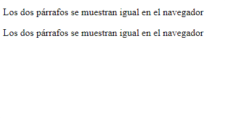

<h1 align=center>Textos</h1>

<hr>

## Contenido:

- Encabezados.
- Párrafos.
- Citar.
- Comentarios

<hr>

### <u>-Encabezados</u>

> Los encabezados se usan para añadir títulos y subtítulos de una página.

- Los encabezados se añaden con la etiqueta `<hn>Encabezado</hn>` n = al número entre 1-6.
- El número indica la jerarquía de los encabezados
  `<h1>Es el más importante</h1> y <h6>Es el menos importante</h6>`
- Los encabezados son una buena herramienta para el SEO, gracias a los encabezados se puede establecer la jerarquía de la web.

```HTML
<!-- Encabezados -->
<h1>Título principal</h1>
<h2>Subtítulo </h2>
<h3>Subtítulo Subtítulo </h3>
<h4>Subtítulo Subtítulo Subtítulo  </h4>
<h5>Subtítulo Subtítulo Subtítulo Subtítulo  </h5>
<h6>Subtítulo Subtítulo Subtítulo Subtítulo  </h6>
```

<hr>

### <u>-Párrafos</u>

> Para insertar un párrafo se utiliza la etiqueta p
> `<p>Esto es texto de relleno</p>`

- Los párrafos se comportan en forma de bloque.
- Los párrafos pueden contener otras etiquetas.
  `<a>,<span>,<strong>,<small>,<mark>...`
- Para hacer un salto de línea dentro de un parrafo se necesita la etiqueta `<br>`
- Si quieres que te detecte los saltos de línea se puede usar la etiqueta `<pre></pre>` para mostrar el código tal cual.
- Los saltos de línea dentro de un parrafo no son visibles en el navegador.

```HTML
<!-- Ejemplo saltos de línea -->
 <p>
      Los
      dos
      párrafos
      se
      muestran
      igual
      en
      el
      navegador
    </p>

    <p>Los dos párrafos se muestran igual en el navegador</p>
```

Resultado:


<hr>

### <u>-Citar</u>

> Para utilizar citas, fuentes y referencias en HTML hay tres etiquetas principales`<blockquote>,<q>,<cite>`.

- `<blockquote>` Para insertar una cita en forma de bloques.
- `<q>` Para insertar una cita en forma de línea.
- `<cite>` Para insertar una cita que haga referencia a un trabajo creativo.

```HTML
<!-- Ejemplo -->
    <blockquote cite="https://developer.mozilla.org/es/">
      <p>
        <strong>Info:</strong> Página web con una gran cantidad de documentación
        sobre HTML,CSS,JS...
      </p>
    </blockquote>
```

<hr>

### <u>-Comentarios</u>

 Los comentarios se usan para añadir información de lo que hace el código. Los comentarios solo son visibles para aquellos que dispongan del código fuente.

 >  Comentario:  `<!-- Esto es un comentario en HTML -->`
 
 **Atajo de teclado para VisualStudioCode ==> Ctrl+k+c**

 


