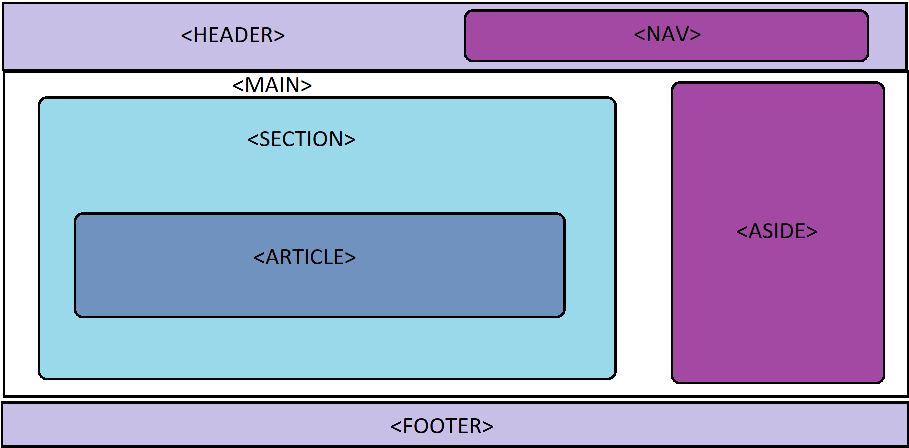

<h1 align=center>Estructuras HTML 5</h1>

En HTML solo existía un tipo de caja `
`. Con HTML 5 llegaron diferentes tipos de cajas para usar con un contenido concreto.

**Cajas para estructurar contenido concreto:**

- `<header>` Se utiliza para definir la cabecera la página web. Suele contener el menú de navegación y el logotipo.
- `<nav>` Se utiliza para definir la navegación de la web.
- `<main>` Se usa para definir el contenido principal del documento.
  - Se suele usar uno por documento.
  - No poner dentro contenido que se repita(Headers,Nav,Footer...).
  - Evitar incluir los main dentro de otra caja.
- `<section>` Se utiliza para representar una sección genérica de un documento.
- `<article>` Se utiliza para representar secciones que no sean genéricas, a modo de artículos independientes como en las revistas.
- `<aside>` Se utiliza para alojar el contenido que tiene menos importancia de la web.
- `<footer>` Se utiliza para definir el pie de la pagina(autor, fecha, copyright, enlaces...).
- `<template>` Esta etiqueta evita el renderizado de cierto contenido al cargar una pagina. Las plantillas `<template>` se ejecutan empleando **JavaScript**.

Ejemplo:

> No es la única formación hay muchas combinaciones posibles. El nav bajo el header , el aside a la izquierda...
