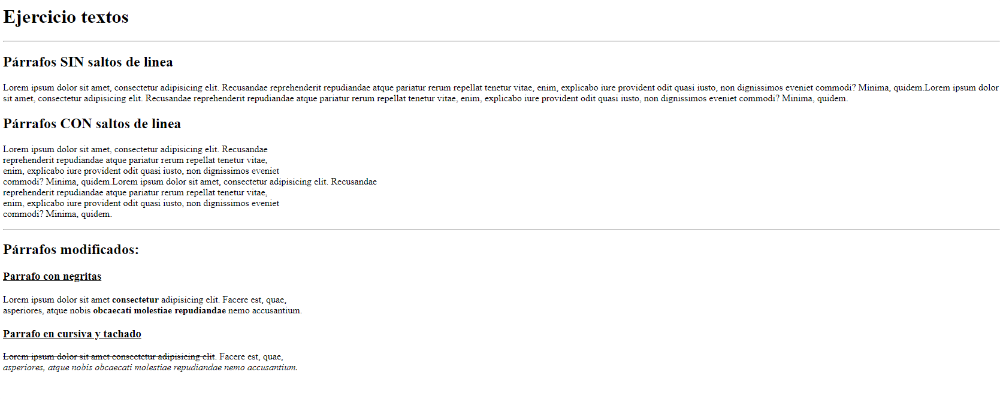

<h1 align="center">Ejercicio Textos</h1>
<hr>

> Mediante el siguiente ejercicios podemos repasar los siguientes temas:

- Encabezados
- Párrafos
- Saltos de linea
- Dar formato al texto

<hr>
## Recrea la siguiente imagen:



> **Bonus:** añade comentarios para dejar clara alguna posible duda.

## Solución:

```HTML
<!DOCTYPE html>
<html lang="en">
  <head>
    <meta charset="UTF-8" />
    <meta http-equiv="X-UA-Compatible" content="IE=edge" />
    <meta name="viewport" content="width=device-width, initial-scale=1.0" />
    <title>Texto</title>
  </head>
  <body>
    <h1>Ejercicio textos</h1>
    <hr />

    <h2>Párrafos SIN saltos de linea</h2>
    <p>
      Lorem ipsum dolor sit amet, consectetur adipisicing elit. Recusandae
      reprehenderit repudiandae atque pariatur rerum repellat tenetur vitae,
      enim, explicabo iure provident odit quasi iusto, non dignissimos eveniet
      commodi? Minima, quidem.Lorem ipsum dolor sit amet, consectetur
      adipisicing elit. Recusandae reprehenderit repudiandae atque pariatur
      rerum repellat tenetur vitae, enim, explicabo iure provident odit quasi
      iusto, non dignissimos eveniet commodi? Minima, quidem.
    </p>

    <h2>Párrafos CON saltos de linea</h2>
    <p>
      Lorem ipsum dolor sit amet, consectetur adipisicing elit. Recusandae
      <br />
      reprehenderit repudiandae atque pariatur rerum repellat tenetur vitae,
      <br />
      enim, explicabo iure provident odit quasi iusto, non dignissimos eveniet
      <br />
      commodi? Minima, quidem.Lorem ipsum dolor sit amet, consectetur
      adipisicing elit. Recusandae <br />
      reprehenderit repudiandae atque pariatur rerum repellat tenetur vitae,
      <br />
      enim, explicabo iure provident odit quasi iusto, non dignissimos eveniet
      <br />
      commodi? Minima, quidem.
    </p>

    <hr />

    <h2>Párrafos modificados:</h2>

    <h3><u>Parrafo con negritas</u></h3>
    <p>
      Lorem ipsum dolor sit amet <strong>consectetur</strong> adipisicing elit. Facere est, quae,
      <br />
      asperiores, atque nobis <b>obcaecati molestiae repudiandae</b> nemo accusantium.
    </p>

    <h3><u>Parrafo en cursiva y tachado</u></h3>
    <p>
      <del>Lorem ipsum dolor sit amet consectetur adipisicing elit</del>. Facere est, quae,
      <br />
      <i>asperiores, atque nobis obcaecati molestiae repudiandae nemo accusantium.</i>
    </p>
  </body>
</html>
```
