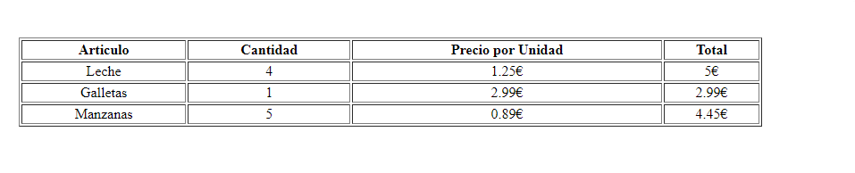
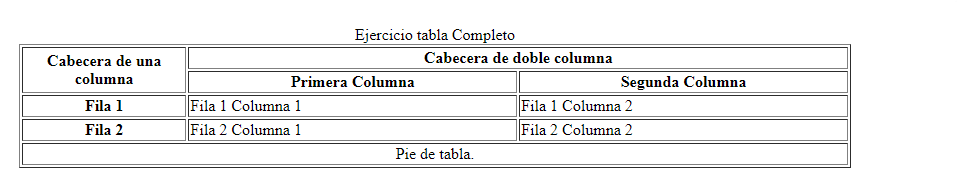

<h1 align="center">Tablas</h1>
<hr>

> Mediante el siguiente ejercicios podemos repasar los siguientes temas:

- Tablas
- Unir celdas

<hr>

### Ejercicios

Recrea la siguiente imagen:

> Para alinear el texto se puede utilizar `align="center"`



**Solución:**

```HTML
    <table border="1" style="width: 50%">
      <tr>
        <th>Articulo</th>
        <th>Cantidad</th>
        <th>Precio por Unidad</th>
        <th>Total</th>
      </tr>

      <tr>
        <td align="center">Leche</td>
        <td align="center">4</td>
        <td align="center">1.25€</td>
        <td align="center">5€</td>
      </tr>

      <tr>
        <td align="center">Galletas</td>
        <td align="center">1</td>
        <td align="center">2.99€</td>
        <td align="center">2.99€</td>
      </tr>

      <tr>
        <td align="center">Manzanas</td>
        <td align="center">5</td>
        <td align="center">0.89€</td>
        <td align="center">4.45€</td>
      </tr>
    </table>
```

<hr>

Recrea la siguiente imagen:

> Para alinear el texto se puede utilizar `align="center"`



**Solución:**

```HTML
 <table border="1" style="width: 50%">
      <caption>
        Ejercicio tabla Complejo
      </caption>
      <colgroup>
        <col style="width: 20%" />
        <col style="width: 40%" />
        <col style="width: 40%" />
      </colgroup>
      <thead>
        <tr>
          <th rowspan="2">Cabecera de una columna</th>
          <th colspan="2">Cabecera de doble columna</th>
        </tr>
        <tr>
          <th>Primera Columna</th>
          <th>Segunda Columna</th>
        </tr>
      </thead>
      <tbody>
        <tr>
          <th>Fila 1</th>
          <td>Fila 1 Columna 1</td>
          <td>Fila 1 Columna 2</td>
        </tr>
        <tr>
          <th>Fila 2</th>
          <td>Fila 2 Columna 1</td>
          <td>Fila 2 Columna 2</td>
        </tr>
      </tbody>
      <tfoot>
        <tr>
          <td colspan="3" align="center">Pie de tabla.</td>
        </tr>
      </tfoot>
    </table>
```
