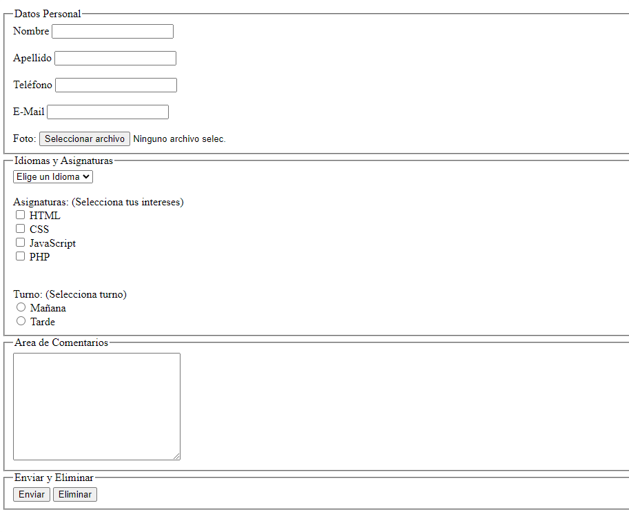

<h1 align="center">Formulario</h1>
<hr>

> Mediante el siguiente ejercicios podemos repasar los siguientes temas:

- Agrupar campos.
- Campos de varios tipos.
- Control de opciones.
- Selectores
- Botones

<hr>

### Ejercicios

Crea un formulario para recuperar datos de los alumnos. Al ser enviados, los datos no deberían ser visibles en la URL.

Los grupos son los siguientes:

**Datos personales**

- Nombre (Requerido)
- Apellido
- Teléfono (Requerido)
- E-Mail (Requerido)
- Foto(Seleccionar archivo)

**Idiomas y Asignaturas**

- Idiomas(Desplegable con varios idiomas)
- Asignaturas(Se pueden elegir varias asignaturas)
- Turno Mañana-Tarde(Solo se puede seleccionar un turno)

**Area de comentario**

- Comentario (Mínimo 10 caracteres)

**Enviar y Eliminar**

- Botón para enviar
- Botón para Eliminar datos



**Solución:**
```HTML
    <form method="post" enctype="text/plain">
      <fieldset>
        <legend>Datos Personal</legend>

        <label for="nombre">Nombre</label>
        <input type="text" id="nombre" required />

        <br />
        <br />

        <label for="apellido">Apellido</label>
        <input type="text" id="apellido" />

        <br />
        <br />

        <label for="tel">Teléfono</label>
        <input type="tel" id="tel" required />

        <br />
        <br />

        <label for="correo">E-Mail</label>
        <input type="email" id="correo" required />

        <br />
        <br />

        <label for="foto">Foto: </label>
        <input type="file" id="foto" />
      </fieldset>

      <fieldset>
        <legend>Idiomas y Asignaturas</legend>
        <select name="idioma">
          <option value="">Elige un Idioma</option>
          <option value="Castellano">Castellano</option>
          <option value="Euskera">Euskera</option>
          <option value="Ingles">Ingles</option>
        </select>

        <br />
        <br />
        <label>Asignaturas: (Selecciona tus intereses)</label>

        <br />
        <input type="checkbox" name="HTML" /> HTML <br />
        <input type="checkbox" name="CSS" /> CSS <br />
        <input type="checkbox" name="JavaScript" /> JavaScript <br />
        <input type="checkbox" name="PHP" /> PHP <br />

        <br />
        <br />
        <label>Turno: (Selecciona turno)</label>

        <br />
        <input type="radio" name="turno" value="mañana" /> Mañana <br />
        <input type="radio" name="turno" value="tarde" /> Tarde <br />
      </fieldset>

      <fieldset>
        <legend>Area de Comentarios</legend>
        <textarea
          name="comentarios"
          id="comentarios"
          cols="30"
          rows="10"
          minlength="10"
        ></textarea>
      </fieldset>

      <fieldset>
        <legend>Enviar y Eliminar</legend>
        <button type="submit">Enviar</button>
        <button type="reset">Eliminar</button>
      </fieldset>
    </form>
```
