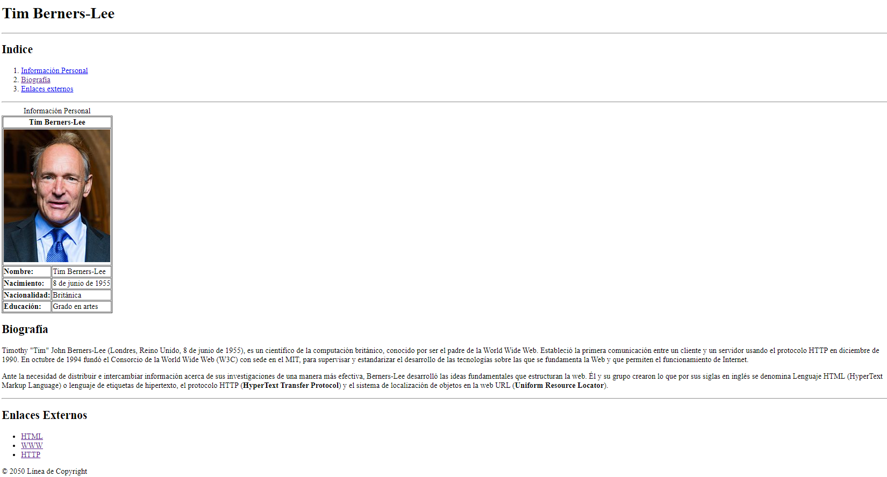

<h1 align="center">Maquetar una biografía(Tim Berners-Lee)</h1>

> Mediante el siguiente ejercicios podemos repasar los siguientes temas:

- Encabezados
- Texto
- Enlaces
- Listas
- Imágenes
- Tablas
- Estructuras HTML5

<hr>

Recrea la siguiente imagen:



**Pequeña ayuda**

- Para agilizar el ejercicio puedes copiar los datos de [Wikipedia-Tim](https://es.wikipedia.org/wiki/Tim_Berners-Lee)

- Usa `<header> <nav> <main> y <footer>` para estructurar el contenido.
- El indice hace referencia a puntos específicos del documento(enlaces ancla).
- Recuerda añadir los bordes `border="1"` a la tabla de información personal para visualizar mejor los datos.
- Los enlaces externos se abren en otra pestaña. Añade el atributo `rel="noopener noreferrer"` para evitar posibles vulnerabilidades.
- Usa ` &copy;` para añadir el símbolo del copyright.

<hr>

**Solución**

```HTML
<!DOCTYPE html>
<html lang="en">
  <head>
    <meta charset="UTF-8" />
    <meta http-equiv="X-UA-Compatible" content="IE=edge" />
    <meta name="viewport" content="width=device-width, initial-scale=1.0" />
    <title>Tim Berners-Lee</title>
  </head>
  <body>
    <header>
      <h1>Tim Berners-Lee</h1>
      <hr />
    </header>

    <nav>
      <h2>Indice</h2>
      <ol>
        <li><a href="#inf_personal">Información Personal</a></li>
        <li><a href="#biografia">Biografía</a></li>
        <li><a href="#enlace_externo">Enlaces externos</a></li>
      </ol>

      <hr />
    </nav>

    <main>
      <table border="1" id="inf_personal">
        <caption>
          Información Personal
        </caption>

        <thead>
          <tr>
            <th colspan="2">Tim Berners-Lee</th>
          </tr>
          <tr>
            <td colspan="2">
              
            </td>
          </tr>
        </thead>

        <tbody>
          <tr>
            <td><b>Nombre:</b></td>
            <td>Tim Berners-Lee</td>
          </tr>

          <tr>
            <td><b>Nacimiento:</b></td>
            <td>8 de junio de 1955</td>
          </tr>

          <tr>
            <td><b>Nacionalidad:</b></td>
            <td>Británica</td>
          </tr>

          <tr>
            <td><b>Educación:</b></td>
            <td>Grado en artes</td>
          </tr>
        </tbody>
      </table>

      <h2 id="biografia">Biografía</h2>
      <p>
        Timothy "Tim" John Berners-Lee (Londres, Reino Unido, 8 de junio de
        1955), es un científico de la computación británico, conocido por ser el
        padre de la World Wide Web. Estableció la primera comunicación entre un
        cliente y un servidor usando el protocolo HTTP en diciembre de 1990. En
        octubre de 1994 fundó el Consorcio de la World Wide Web (W3C) con sede
        en el MIT, para supervisar y estandarizar el desarrollo de las
        tecnologías sobre las que se fundamenta la Web y que permiten el
        funcionamiento de Internet.
      </p>

      <p>
        Ante la necesidad de distribuir e intercambiar información acerca de sus
        investigaciones de una manera más efectiva, Berners-Lee desarrolló las
        ideas fundamentales que estructuran la web. Él y su grupo crearon lo que
        por sus siglas en inglés se denomina Lenguaje HTML (HyperText Markup
        Language) o lenguaje de etiquetas de hipertexto, el protocolo HTTP (<b
          >HyperText Transfer Protocol</b
        >) y el sistema de localización de objetos en la web URL (<b
          >Uniform Resource Locator</b
        >).
      </p>

      <hr />
    </main>

    <footer>
      <h2 id="enlace_externo">Enlaces Externos</h2>
      <ul>
        <li>
          <a
            href="https://es.wikipedia.org/wiki/HTML"
            target="_blank"
            rel="noopener noreferrer"
            >HTML</a
          >
        </li>
        <li>
          <a
            href="https://es.wikipedia.org/wiki/World_Wide_Web"
            target="_blank"
            rel="noopener noreferrer"
            >WWW</a
          >
        </li>
        <li>
          <a
            href="https://es.wikipedia.org/wiki/Protocolo_de_transferencia_de_hipertexto"
            target="_blank"
            rel="noopener noreferrer"
            >HTTP</a
          >
        </li>
      </ul>

      &copy; 2050 Línea de Copyright
    </footer>
  </body>
</html>
```
