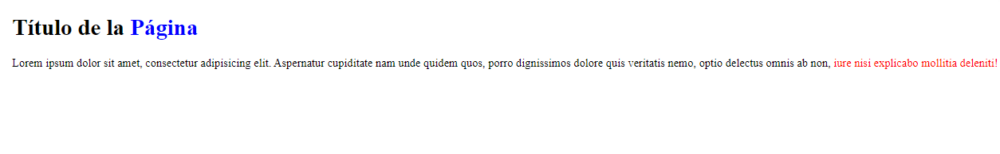
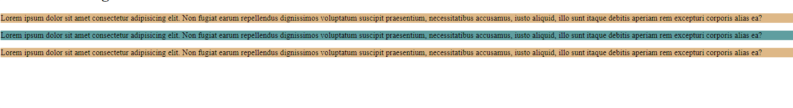
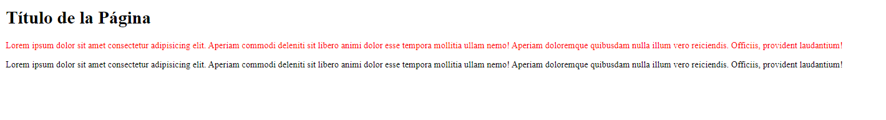

<h1 align="center">Selectores<h1>
<hr>

## Contenido

- Partes de una regla CSS
- Selector universal
- Selector de tipo
- Selector descendiente
- Selector de clase e Id
- Selector de atributo
- Selector adyacente

<hr>

### Partes de una regla CSS

> Una regla de CSS es el conjunto de propiedades que se aplica a un elemento.

Sintaxis: `body { color: tomato}`

- **Regla de CSS:** body { color: tomato}
- **Selector:** body
- **{:** Llave de apertura
- **Declaración:** { color: tomato}
- **Propiedad:** body
- **Valor:** tomato
- **}:** Llave de cierre

**Las propiedades pueden tener más de un valor**
**Algunas propiedades pueden hacer uso de una version reducida(abreviada)**
```CSS
/* Version larga */
border-width:1px;
border-style:solid;
border-color: black;

/* Version reducida */
border:1px solid black;
```

<hr>

### Selector universal

> El selector universal `*` sirve para seleccionar todos los elementos. Mediante este selector podemos aplicar estilos a todos los elementos de la página.

Ejemplo:

```CSS
/* Aplicar un tamaño de fuente y un color a todos los elementos */
    * {
        font-size: 20px;
        color: green;
      }
```

<hr>

### Selector de tipo

> Los selectores de tipo seleccionan todos los elementos que pertenezcan a ese tipo concreto.
> Si quieres aplicar estilos a todos los encabezados `<h1>` se puede usar el selector de tipo `h1{Declaraciones}`. En resumen, seleccionar por etiquetas HTML.
> Se puede aplicar una misma regla para varios tipos de selectores separándoles con comas. `h1,h2,h3 {propiedad: valor;}`


Ejemplo:

```CSS
/* Aplicar un tamaño de fuente y un color a todos los elementos del body*/
    body {
        font-size: 20px;
        color: green;
      }

/* Aplicar bordes a todos los encabezados h1*/
    h1 {
        border: 3px solid black;
      }
```

### Selector descendiente

> Los selectores seleccionan los elementos que se encuentran dentro de otros elementos. El estilo solo se aplicara a los elementos que se encuentren dentro del elemento padre.
> Para seleccionar solo los hijos directos se puede usar el mayor que > entre los selectores `p > span`.

Ejemplo:

Aplicar un color azul a todos los `<span>` y un color rojo a los que se encuentran dentro de un parrafo.

```HTML
    <h1>Título de la <span>Página</span></h1>

    <p>
      Lorem ipsum dolor sit amet, consectetur adipisicing elit. Aspernatur
      cupiditate nam unde quidem quos, porro dignissimos dolore quis veritatis
      nemo, optio delectus omnis ab non, <span>iure nisi explicabo mollitia deleniti!</span>
    </p>
```

```CSS
      span {
        color: blue;
      }
      p span {
        color: red;
      }
```



<hr>

### Selector de Clase e ID

> Los selectores de clase e Id sirven para agrupar e identificar elementos HTML y aplicar un estilo.
> No se puede usar el mismo nombre para varios ids.
> Se puede usar los selectores descendientes con clases e ids. Para las clases se usa un . delante del nombre y para los id se usa # delante del nombre.

> Sintaxis(HTML):
> `<h1 class="nombre-de-la-clase">Título de la Página</h1>`
> `<h1 id="nombre-del-id">Título de la Página</h1>`

> Sintaxis(CSS):
> `.nombre-de-la-clase{ propiedad: valor}`
> `#nombre-del-id{ propiedad: valor}`

<u>Diferencias:</u>

- Las clases se pueden aplicar a varios elementos, el ID no.
- Los ID tienen mayor especificidad que las clases.
- Selector de Clase = .
- Selector de Id = #

Ejemplo:

```HTML
<!-- HTML -->
    <p class="parrafos_secundarios">
      Lorem ipsum dolor sit amet consectetur adipisicing elit. Non fugiat earum
      repellendus dignissimos voluptatum suscipit praesentium, necessitatibus
      accusamus, iusto aliquid, illo sunt itaque debitis aperiam rem excepturi
      corporis alias ea?
    </p>

    <p id="parrafos_principal">
      Lorem ipsum dolor sit amet consectetur adipisicing elit. Non fugiat earum
      repellendus dignissimos voluptatum suscipit praesentium, necessitatibus
      accusamus, iusto aliquid, illo sunt itaque debitis aperiam rem excepturi
      corporis alias ea?
    </p>

    <p class="parrafos_secundarios">
      Lorem ipsum dolor sit amet consectetur adipisicing elit. Non fugiat earum
      repellendus dignissimos voluptatum suscipit praesentium, necessitatibus
      accusamus, iusto aliquid, illo sunt itaque debitis aperiam rem excepturi
      corporis alias ea?
    </p>
```

```CSS
/* CSS */
     #parrafos_principal {
      background-color: cadetblue; /*Azul*/
     }

     .parrafos_secundarios {
      background-color: burlywood; /*Marron*/
     }
```



<hr>

### Selector de Atributo

> El selector de Atributo permite seleccionar elementos en función de su atributo o el valor del atributo.
> Sintaxis: selector[atributo="valor"]{propiedad: valor}

**Caracteres para ser mas específicos:**

> Sintaxis: selector[atributo**carácter**="valor"]{propiedad: valor}

- (\*) --> Todos los elementos que contengan ese valor.
- (^) --> Todos los elementos que empiezan por ese valor.
- ($) --> Todos los elementos que terminan por ese valor.
- (~) --> Buscar un valor sin importar si esta separado por espacios.
- (i o I) --> Para evitar distinguir valores en mayúsculas o minúsculas. Agregar antes del corchete de cierre.
- (s o S) --> Para distinguir valores en mayúsculas o minúsculas. Agregar antes del corchete de cierre.

Ejemplos:

```HTML
<!-- Enlaces -->
    <a href="informacion.html">Información</a>
    <a href="blog.html">Blog</a>
    <a href="contactos.php">Contactos</a>
```

```CSS
/* CSS */

    /* Cambiar el color(rojo) a todos los enlaces que tengan el atributo. */
     a[href]{
        color: red;
      }
      /* Cambiar el color(azul) a todos los enlaces que contengan el valor `href="blog.html"`. */
      a[href="blog.html"]{
        color: blue;
      }
      /* Cambiar el color(verde) a todos los enlaces que terminen con .php */
      a[href$=".php"] {
        color: green;
      }
```

<hr>

### Selector Adyacente

> Los selectores adyacentes (+) seleccionan solo los elementos que van precedidos por el primer elemento.

```HTML
<!-- HTML -->
    <h1>Título de la Página</h1>

    <p>
      Lorem ipsum dolor sit amet consectetur adipisicing elit. Aperiam commodi
      deleniti sit libero animi dolor esse tempora mollitia ullam nemo! Aperiam
      doloremque quibusdam nulla illum vero reiciendis. Officiis, provident
      laudantium!
    </p>

    <p>
      Lorem ipsum dolor sit amet consectetur adipisicing elit. Aperiam commodi
      deleniti sit libero animi dolor esse tempora mollitia ullam nemo! Aperiam
      doloremque quibusdam nulla illum vero reiciendis. Officiis, provident
      laudantium!
    </p>
```

```CSS
/* CSS */
      h1 + p {
        color: red;
      }
```


