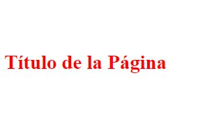

<h1 align="center">Cascada y Especificidad<h1>
<hr>

## Contenido

- Cascada
- Especificidad

<hr>

## Cascada

CSS lee la información en cascada. Si aplicas dos estilos distintos al mismo elemento se aplicara el ultimo estilo. Con el ejemplo se ve mejor.

El algoritmo en cascada se divide en varias etapas:

- Posición y orden de aparición: Es el orden en el que aparecen tus reglas CSS.
- Especificidad: Un algoritmo que determina qué selector de CSS tiene la puntuación más fuerte.
- Origen: El orden y la procedencia en el que se importa.
- Importancia: Dependiendo la puntuación que tengan algunas reglas CSS tienen más peso que otras.

```HTML
<!-- HTML -->
<h1>Título de la Página</h1>
```

```CSS
/* CSS */
    h1 {
        color: blue;
      }

      h1 {
        color: red;
      }
```

**Resultado**


<hr>

## Especificidad

Piensa en especificidad como un sistema de puntuación, el selector con más puntuación se mostrara en el navegador.

### Puntuaciones para cada selector

<u>**Selectores Universales**</u>

> Un selector universal (\*) no tiene especificidad y obtiene 0 puntos. Esto significa que cualquier regla con 1 o más puntos lo anulará.

<u>**Selector de elementos o pseudoelementos**</u>

> Un selector de elemento (tipo) o pseudoelemento obtiene 1 punto de especificidad. div{} ::selection{}

<u>**Selector de clase, pseudoclase o atributo**</u>

> Un selector de clase, pseudoclase o atributo obtiene 10 puntos de especificidad. .clase{} :hover{} [href='#']{}

<u>**Selector de ID**</u>

> Un selector de ID obtiene 100 puntos de especificidad, siempre que use un selector de ID (#myID) y no un selector de atributo ([id="myID"]).

<u>**Atributo de estilo en línea**</u>

> El CSS aplicado directamente al atributo style del elemento HTML, obtiene una puntuación de especificidad de 1.000 puntos. Esto significa que para anularlo en CSS, debe escribir un selector extremadamente específico

<u>**Regla !important**</u>

> Por último, escribir !important al final de un valor de CSS obtiene una puntuación de especificidad de 10.000 puntos. Esta es la mayor especificidad que puede obtener un objeto individual.

**Practica:**

Dada las siguientes reglas CSS que color crees que se aplicaría al elemento:

(1) Ejercicio:

```HTML
    <h1>Título de la Página</h1>
```

```CSS
      * {
        color: green;
      }

      h1 {
        color: yellow;
      }
```

<hr>

(2) Ejercicio:

```HTML
    <h1 class="encabezadoClase" id="encabezadoID">Título de la Página</h1>
```

```CSS
      * {
        color: green;
      }

      h1 {
        color: yellow;
      }

      .encabezadoClase {
        color: pink;
      }

      #encabezadoID {
        color: blue;
      }
```

<hr>

(3) Ejercicio:

```HTML
    <h1 class="encabezadoClase" id="encabezadoID" style="color: purple">Título de la Página</h1>
```

```CSS
      * {
        color: green;
      }

      h1 {
        color: yellow;
      }

      .encabezadoClase {
        color: pink;
      }

      #encabezadoID {
        color: blue;
      }
```

<hr>

(4) Ejercicio:

```HTML
    <h1 class="encabezadoClase" id="encabezadoID" style="color: purple">
        Título de la Página
    </h1>
```

```CSS
      h1 {
        color: red !important;
      }

      * {
        color: green;
      }

      h1 {
        color: yellow;
      }

      .encabezadoClase {
        color: pink;
      }

      #encabezadoID {
        color: blue;
      }
```
### Respuestas:

- (1) Ejercicio: **yellow**
- (2) Ejercicio: **blue**
- (3) Ejercicio: **purple**
- (4) Ejercicio: **red**