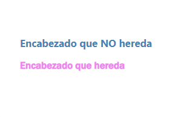

<h1 align="center">Herencia<h1>
<hr>

## Contenido

- Herencia
- Control de la herencia

<hr>

### Herencia

En CSS existen propiedades que se heredan, se trasmiten desde los elementos padres a los elementos hijos. Esto hace que se modifiquen algunos valores que tienen por defecto.
No todas las propiedades se heredan, si el elemento padre tiene un margin, un padding un ancho/alto, bordes... este tipo de propiedades no serán trasmitidas a sus hijos.

Ejemplo:
Si aplicamos una regla CSS que cambie el color del texto de un `body`, todos los hijos del elemento `body` heredaran por defecto dicho color.

<hr>

### Control de la herencia

Haciendo uso de algunas propiedades podemos controlar la herencia.

- inherit: Hace que el element hijo obtenga el valor trasmitido por el padre. Es necesario sólo para anular otras reglas.
- initial: Elimina las herencias y utiliza el valor inicial, las propiedades por defecto del elemento.

Ejemplo:

```HTML
<!-- HTML -->
    <h3>Encabezado que NO hereda</h3>

    <main>
      <h3>Encabezado que hereda</h3>
    </main>
```

```CSS
      h3 {
        color: steelblue;
        font-family: "Segoe UI", Tahoma, Geneva, Verdana, sans-serif;
      }

      main {
        color: violet;
        font-family: "Franklin Gothic Medium", "Arial Narrow", Arial, sans-serif;
      }

      /* Hereda el color y la fuente del padre(main) */
      main h3 {
        color: inherit;
        font-family: inherit;
      }
```

Resultado:

