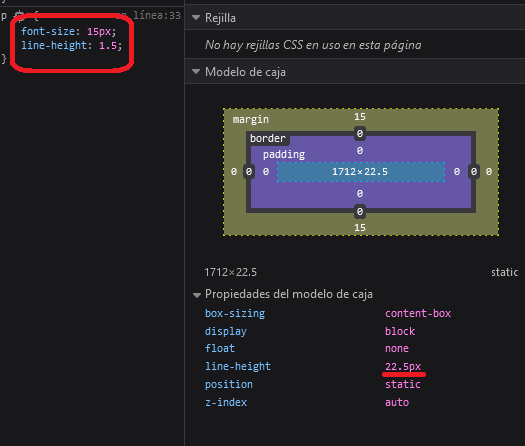
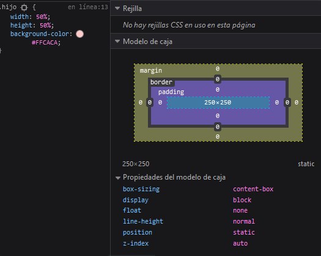

<h1 align="center">Unidades de medida<h1>
<hr>

## Contenido

- Números
- Porcentaje
- Dimensiones y longitudes

<hr>

### Números

Los números se utilizan para asignar valor al `line-height`(establece la distancia entre líneas de texto), `opacity`(transparencia) y colores `rgb`. En el caso de `line-height` el valor que se utilice es x veces el tamaño de la letra. Si utilizamos un tamaño de fuente de 15 px y un `line-height` de 1.5 este seria el 150% de 15px = 22.5px. La opacidad o transparencia va desde 0 hasta 1, siendo 1 lo más "oscuro".

Ejemplo `line-height`.


---

### Porcentajes

Al usar un valor en forma de porcentaje es importante saber que el % esta relacionado con su padre.

Ejemplo:

```HTML
    <div class="padre">
      <div class="hijo"></div>
    </div>
```

```CSS
    .padre {
        width: 500px;
        height: 500px;
        background-color: #251B37;
      }

      .hijo {
        width: 50%;
        height: 50%;
        background-color: #FFCACA;
      }
```



> El hijo tendrá un tamaño de 250x250 la mitad del ancho y alto del padre.

---

### Dimensiones y longitudes

Las dimensiones se crean al juntar una unidad con un número. Las longitudes son dimensiones que se refieren a la distancia y pueden ser absolutas o relativas.

**Longitudes absolutas**

Las longitudes absolutas se resuelven contra la misma base, se podría decir que no varían el tamaño.

Algunas unidades:

- Píxeles (px) ==> 1px = 1/96 de 1in
- Centímetros (cm) ==> 1cm = 96px/2,54
- Milímetros (mm) ==> 1mm = 1/10 de 1cm
- Pulgadas (in) ==> 1in = 2,54cm = 96px
- Puntos (pt) ==> 1pt = 1/72 de 1in

> El valor que más se usa en pantalla son los Píxeles. El resto de unidades son para formatos impresos.

**Longitudes relativa**

Estas unidades son relativas a algo, se calculan contra un valor base. El tamaño de la ventana, el tamaño del elemento padre, tamaño de la letra...
Como se pueden dimensionar, nos facilitan el trabajo a la hora de hacer un diseño web adaptable.

Algunas unidades:

- em calcula el tamaño en base al padre. 1.5em será un 50% más grande que el padre.
- rem calcula el tamaño en base de la raíz(root). Por defecto es 16px.
- Viewport: Unidades relativas a la ventana.
  - vw 1% de la anchura de la ventana gráfica. 
  - vh 1% de la altura de la ventana gráfica.
  - vmin 1% de la dimensión más pequeña de la ventana gráfica.
  - vmax 	1% de la dimensión más grande de la ventana gráfica.
