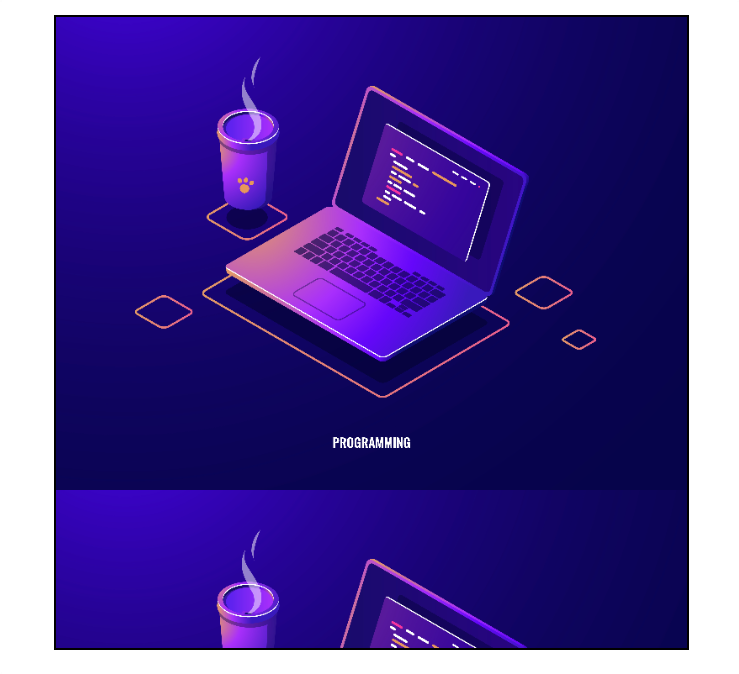

<h1 align="center">Imágenes<h1>
<hr>

## Contenido

- Tamaño de las imágenes básico
- Redondear Imágenes
- Imagen escalable
- Texto
- Imagen de fondo
- objet-fit
- objet-position

<hr>

### Tamaño de las imágenes básico

Con CSS podemos manejar diferentes propiedades para dar estilos a las imágenes. Cada imagen por defecto suele tener su propio ancho y alto. Para modificar el tamaño de la imagen se usan las mismas propiedades que para cualquier otro elemento `with y height`.

> Existe un equivalente al Lorem ipsum(texto de relleno) para añadir imágenes de relleno [Picsum](https://picsum.photos/).

Ejemplo: Modificar el ancho y alto.

```HTML
<!-- HTML -->

<!-- Por defecto la img tiene un ancho de 200px y un alto de 300px -->
```

```CSS
/* CSS */
    img{
        width: 500px;
        height: 500px;
      }
```

### Redondear imágenes

Aunque redondeemos una imagen recordemos que el navegador no redondeara la caja "box-model".

Ejemplo:


> Podemos redondear una imagen con la propiedad `border-radius:50%;`

---

### Imagen escalable

Podemos hacer que una imagen se reduzca si es necesario y que no se amplié más de su tamaño.

Ejemplo:

```HTML
<!-- HTML -->

<!-- Por defecto la img tiene un ancho de 200px y un alto de 300px -->
```

```CSS
/* CSS */
     img{
        max-width: 100%;
        height: auto;
      }
```

---

### Textos

En este apartado veremos como sobreponer texto a una imagen. Es un recurso bastante utilizado a la hora de crear páginas web.

Ejemplo: Sobreponer texto en una imagen(no background-image).

```HTML
<!-- HTML -->
<!-- Una caja que agrupa un encabezado y una imagen -->
    <div>
      <h2>Texto de relleno que se sobrepondrá en la imagen</h2>
      
    </div>

```

```CSS
/* CSS */

/*Aplicamos una posición relativa y un ancho y alto máximo y mínimo para la caja.*/

    div {
        position: relative;
        max-width: 600px;
        min-width: 250px;
        width: 60%;
        margin: 10px auto;
      }

/*
Al encabezado le asignamos una posición absoluta para moverlo sobre la caja con top y left.
Aplicamos un color y un tamaño de fuente para resaltar el encabezado.

*/
h2 {
        position: absolute;
        top: 30%;
        left: 15%;
        font-size: 2rem;
        font-weight: 300;
        color: white;

      }
```


### Imagen de fondo

Si en vez de añadir una imagen desde el HTML lo que queremos es añadir una imagen de fondo podemos hacer uso de la propiedad background-image.

> Sintaxis: `background-image: url("Ruta-del-enlace");`

Ejemplo: Añadir una imagen a un `<div>`

```HTML
<!-- HTML -->
<div></div>
```

```CSS
/* CSS */
     div {
        width: 400px;
        height: 400px;
        background-image: url("https://picsum.photos/400/400");
      }
```

---

**Propiedades para imágenes de fondo**

Al aplicar una imagen de fondo puede que la imagen no se comporte como esperamos que lo haga. Puede que la imagen se repita, no cubra todo el espacio, cubra demasiado espacio, se extienda por debajo de un borde...
Por defecto si la caja es mas grande que la imagen, esta se repetirá hasta rellenar la caja.
Con la propiedad `background-repeat: no-repeat;` evitaremos que se repitan.

Propiedades para editar imágenes de fondo:

- background-repeat: Para controlar la repetición de las imágenes.
- background-position: Para especificar la posición dentro de la caja que abarca la imagen de fondo.
  - Primer valor vertical segundo horizontal.
- background-size: Para especificar el tamaño de las imágenes de fondo.
- background-clip: Para controlar las imágenes-colores de fondo no se extiendan del borde.

**Ejemplos con imágenes más pequeñas que la caja**

Evitar que se repita:


```HTML
<!-- HTML -->
<div></div>
```

```CSS
/* CSS */
     div {
        width: 700px;
        height: 700px;
        border: 3px solid black;
        background-image: url("img/prueba-small.png");
        background-repeat: no-repeat;
      }
```


---

Posicionar la imagen en el centro(vertical) y derecha(horizontal):

```HTML
<!-- HTML -->
<div></div>
```

```CSS
/* CSS */
     div {
        width: 700px;
        height: 700px;
        border: 3px solid black;
        background-image: url("img/prueba-small.png");
        background-repeat: no-repeat;
        background-position: center right;
      }
```


---

Rellenar todo el fondo de la caja:

Hay varias formas de rellenar la caja con `background-size:`

- background-size: 100%;
- background-size: cover;
- background-size: contain;

A simple vista puede parecer que cover y contain hagan lo mismo pero no, contain respeta la relación dimensiona. Cover completa el ancho y el alto pero puede cortar información si lo necesita.

```HTML
<!-- HTML -->
<div></div>
```

```CSS
/* CSS */
     div {
        width: 700px;
        height: 700px;
        border: 3px solid black;
        background-image: url("img/prueba-small.png");
        background-size: contain;
      }
```


---

**Ejemplos con imágenes más grande que la caja**

En este caso no se repetirá la imagen pero solo sera visible la parte que la caja deje visualizar.


---

Con una imagen mas grande que la caja se puede apreciar bien la diferencia entre cover y contain.

> **Contain**
> Contain muestra la imagen completa sin recortar nada, pero si la imagen no es capaz de abarcar toda la caja rellenara lo que sobre repitiendo la imagen.
> 

> **Cover**
> Cover muestra la imagen completa recortando partes para adaptarse a la caja.
> 

---

Cuando las imágenes son mas grandes podemos hacer foco en una zona más concreta.

Hacer "focus" en la parte inferior derecha:

```HTML
<!-- HTML -->
<div></div>
```

```CSS
/* CSS */
      div {
        width: 700px;
        height: 700px;
        border: 3px solid black;
        background-image: url("img/pruebas.jpg");
        background-size: cover;
        background-position: bottom right;
      }
```

> 

---

### objet-fit y object-position

La propiedad objet-fit es muy parecida al background-size, objet-fit nos permite escalar imágenes dentro del objeto ``

Ejemplo:

```HTML
<!-- HTML -->

```

```CSS
/* CSS */
      img {
        width: 500px;
        height: 500px;
        background-color: plum;
        object-fit: scale-down;
      }
```

> La imagen se hace más pequeña dentro del obj imagen. Lo rosa es el fondo del elemento `` > 

---

La propiedad objet-position es muy parecida al background-position, objet-position nos permite posicionar imágenes dentro del objeto ``

Ejemplo:

```HTML
<!-- HTML -->

```

```CSS
/* CSS */
      img {
        width: 500px;
        height: 500px;
        background-color: plum;
        object-fit: scale-down;
        object-position: bottom;
      }
```

> La imagen se hace más pequeña y se posiciona en la parte inferior dentro del obj imagen. Lo rosa es el fondo del elemento `` > 
