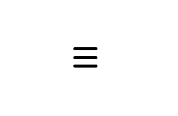
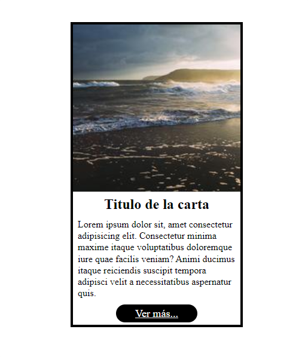
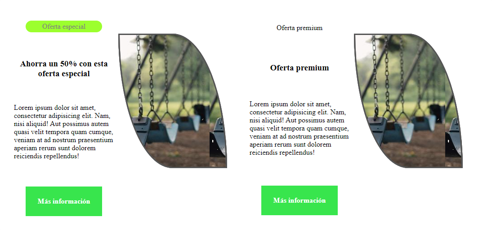

<h1 align="center">Componentes<h1>
<hr>

## Contenido

- Menú de navegación despegable
- Menú de navegación estilo hamburguesa.
- Icono menu hamburguesa

<hr>

> En este articulo veremos un par de ejercicios para crear los componentes. Los componentes no tienen que ser exactamente iguales, son una pequeña guía.

### Menú de navegación despegable.

Recrea el siguiente menú de navegación despegable. Es un menú de navegación sencillo pero util para repasar `listas,flexbox,display,position`.


> **Solución:** Comprueba o descarga el código en [Github](https://enlaceGithub/).

---

### Menú de navegación estilo hamburguesa.

Recrea el siguiente menú de navegación estilo hamburguesa.


**Pistas**

Para la animación se puede utilizar un pseudoelemento que añada contenido después de un elemento. Para la transición inferior echa un ojo a la propiedad [clip-path](https://developer.mozilla.org/en-US/docs/Web/CSS/clip-path). En la web [bennettfeely](https://bennettfeely.com/clippy/) puedes generar `clip-path` de una manera sencilla. Recuerda que se puede asociar un checkbox y un label, en el label podemos incluir el icono de menu-hamburguesa y controlarlo con la pseudoclase `:checked`.

> **Solución:** Comprueba o descarga el código en [Github](https://enlaceGithub/).

---

### Icono menu hamburguesa

Recrea el siguiente icono, es un icono hamburguesa que cambia a un icono de cerrar. Recuerda que con `transform` se pueden rotar elementos.



> **Solución:** Comprueba o descarga el código en [Github](https://enlaceGithub/).

---

### Layout Punto Ruptura

Recrea el siguiente layout sin usar selectores de clase ni de Id.

**Grande**


**Pequeño**


> **Solución:** Comprueba o descarga el código en [Github](https://enlaceGithub/).

---

### Carta

Recrea la siguiente carta estilo a las de bootstrap.



> **Solución:** Comprueba o descarga el código en [Github](https://enlaceGithub/).

---

### Carta promociones

Recrea la siguiente carta de ofertas y promociones.

**Forma de la imagen**

```CSS
/* CSS */
 selector{
     width: valor;
     height: valor;
     border: 3px solid #555;
     border-radius: 0 50% / 0 100%;
     -moz-border-radius: 0 50% / 0 100%;
     -webkit-border-radius: 0 50% / 0 100%;
 }

```



> **Solución:** Comprueba o descarga el código en [Github](https://enlaceGithub/).

---


### Posicionamiento

Recrea la siguiente web para dispositivos grandes(no es responsive) lo más fiel posible.


**Efecto-sombra del titulo**

```CSS
/* CSS */
 selector{
     text-shadow: -3px 3px var(--gris-clarito), -3px -3px var(--gris-clarito),
                  3px -3px var(--gris-clarito), 3px 3px var(--gris-clarito),
                  6px 6px var(--gris-oscuro);
 }

```


> **Solución:** Comprueba o descarga el código en [Github](https://enlaceGithub/).

---