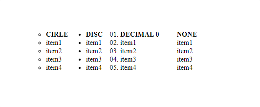
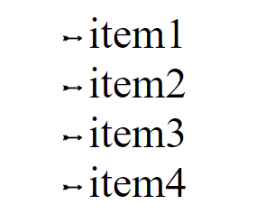
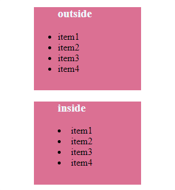
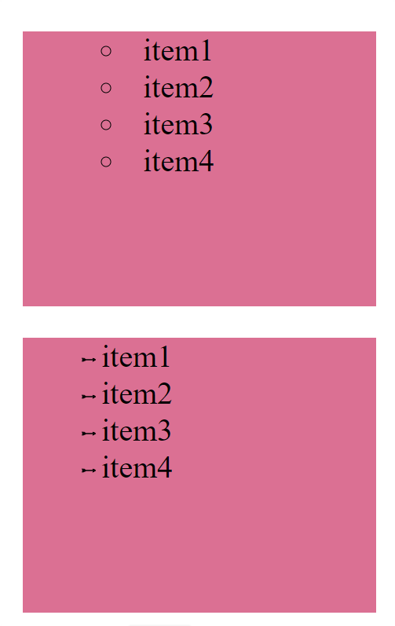

<h1 align="center">Listas<h1>
<hr>

## Contenido

- Cambiar marcador
- Usar imagen como marcador
- Posición del marcador
- Forma abreviada

<hr>

### Cambiar marcador

Una de las propiedades más destacadas de una lista es el marcador, el marcador resalta los "items" de la lista. Para cambiar los tipos de los marcadores podemos usar la propiedad `list-style-type`.

> Sintaxis: `list-style-type: valor`

**Algunos Valores:**

- disc
- circle
- square
- decimal
- decimal-leading-zero
- none

Ejemplos:

```HTML
<!-- HTML -->
    <ol>
      <li><b>CIRLE</b></li>
      <li>item1</li>
      <li>item2</li>
      <li>item3</li>
      <li>item4</li>
    </ol>

    <ol>
      <li><b>DISC</b></li>
      <li>item1</li>
      <li>item2</li>
      <li>item3</li>
      <li>item4</li>
    </ol>

    <ol>
      <li><b>DECIMAL 0</b></li>
      <li>item1</li>
      <li>item2</li>
      <li>item3</li>
      <li>item4</li>
    </ol>

    <ol>
      <li><b>NONE</b></li>
      <li>item1</li>
      <li>item2</li>
      <li>item3</li>
      <li>item4</li>
    </ol>
```

```CSS
/* CSS */
     ol {
        float: left; /* Permite que los elementos se ubiquen a su izquierda*/
      }
      ol:nth-child(1) {
        list-style-type: circle;
      }
      ol:nth-child(2) {
        list-style-type: disc;
      }
      ol:nth-child(3) {
        list-style-type: decimal-leading-zero;
      }
      ol:nth-child(4) {
        list-style-type: none;
      }
```

Resultado:


---

### Usar imagen como marcador

Si los marcadores que tiene por defecto se te quedan cortos se pueden personalizar con imágenes utilizando la propiedad `list-style-image`.

> Sintaxis: `list-style-image: url("");`

Ejemplo:

```HTML
<!-- HTML -->
    <ul>
      <li>item1</li>
      <li>item2</li>
      <li>item3</li>
      <li>item4</li>
    </ul>
```

```CSS
/* CSS */
     ul{
        list-style-image: url("img/arrow-svgrepo-com.svg");
      }
```

Resultado:


---

### Posición del marcador

Con la propiedad `list-style-position` podemos establecer la posición del marcador respecto al contenido de ese mismo elemento. Los valores son `inside` y `outside`, este ultimo es el valor por defecto.

> Sintaxis: `list-style-position: valor;`

Ejemplo:

```HTML
<!-- HTML -->
     <ul>
      <h3>outside</h3>
      <li>item1</li>
      <li>item2</li>
      <li>item3</li>
      <li>item4</li>
    </ul>

    <ul>
      <h3>inside</h3>
      <li>item1</li>
      <li>item2</li>
      <li>item3</li>
      <li>item4</li>
    </ul>
```

```CSS
/* CSS */
     h3{
        color: aliceblue;
      }
      ul{
        width: 140px;
        height: 140px;
      }
      ul:nth-child(1) {
        background-color: palevioletred;
        list-style-position: outside;
      }
      ul:nth-child(2) {
        background-color: palevioletred;
        list-style-position: inside;
      }
```

Resultado:


---

### Forma abreviada

Las tres propiedades anteriores ` list-style-type, list-style-image y list-style-position` se pueden abreviar en `list-style`.

> Sintaxis: `list-style: Valor de list-style-type || list-style-position || list-style-image `

Ejemplo:

```HTML
<!-- HTML -->
    <ul>
      <li>item1</li>
      <li>item2</li>
      <li>item3</li>
      <li>item4</li>
    </ul>

    <ul>
      <li>item1</li>
      <li>item2</li>
      <li>item3</li>
      <li>item4</li>
    </ul>
```

```CSS
/* CSS */
     h3 {
        color: aliceblue;
      }
      ul {
        width: 140px;
        height: 140px;
      }
      ul:nth-child(1) {
        background-color: palevioletred;
        list-style: inside circle;
      }
      ul:nth-child(2) {
        background-color: palevioletred;
        list-style: outside url("img/arrow-svgrepo-com.svg");
      }
```

Resultado:


---
