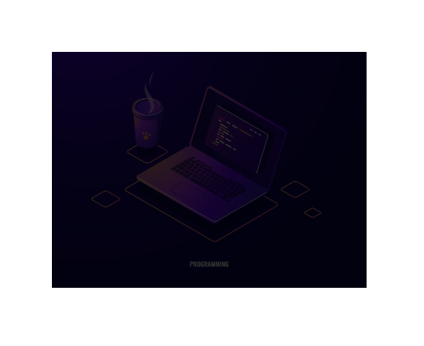
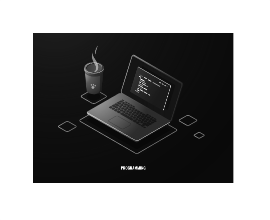

<h1 align="center">Filtros<h1>
<hr>

## Contenido

- Filtros
  - blur
  - Brightness
  - Grayscale
  - Drop-shadow
- Filtro de fondo

<hr>

### Filtros

> Mediante el uso de filtros podemos añadir efectos a diferentes elementos. Para aplicar estos filtros usaremos la propiedad `filter`.

Ejemplos:

**Blur(desenfoque)**
Este filtro recibe un argumento, tiene que ser una unidad de longitud que no sea un porcentaje.

```HTML
<!-- HTML -->
    
```

```CSS
/* CSS */
     img{
        width: 400px;
        filter: blur(20px);
      }
```

## 

---

**Brightness(brillo)**
Este filtro recibe un argumento, tiene que ser un porcentaje. 0% es negro y 100% es el valor inicial.

```HTML
<!-- HTML -->
    
```

```CSS
/* CSS */
     img{
        width: 400px;
        filter: brightness(20%);
      }
```

## 

---

**Grayscale(escala de grises)**
Este filtro recibe un argumento, puede ser un porcentaje o un `1` o `0`.
1- Aplica escala de grises.
0- Elemento por defecto.

```HTML
<!-- HTML -->
    
```

```CSS
/* CSS */
     img{
        width: 400px;
        filter: grayscale(1);
      }
```

## 

---

**Drop-shadow(sobras paralelas)**
Este filtro recibe un argumento, las areas del elemento y el color.

```HTML
<!-- HTML -->
    
```

```CSS
/* CSS */
     img{
        width: 400px;
        filter: drop-shadow(5px 5px 20px purple);
      }
```

## 

---

### Filtro de fondo

Con la propiedad `backdrop-filter` podemos aplicar filtros al fondo del elemento. `backdrop-filter` acepta los mismos valores y utiliza la misma sintaxis que `filter`.

Filter se aplica a todo el elemento.

Backdrop-filter se aplica al fondo del elemento.