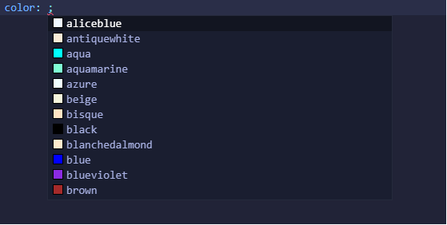
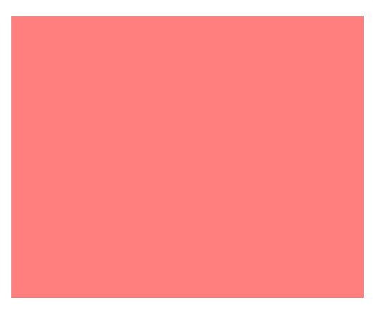
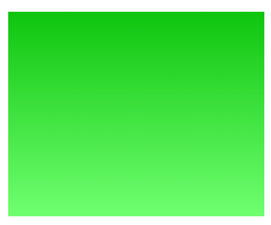
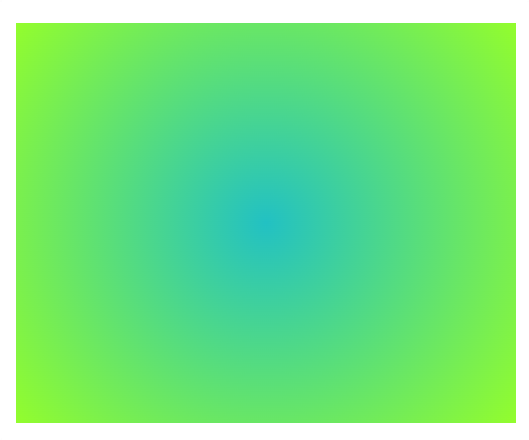

<h1 align="center">Colores<h1>
<hr>

## Contenido

- Nombres simples
- RGBA
- Hexadecimal
- HSL
- Degradado
- Tener en cuenta

<hr>

### Colores

En CSS existen varias formas de especificar colores. Nombres simples en inglés, colores hexadecimales, RGBA(Rojo, Verde, Azul), HSL(tono, saturación, luminosidad), gradientes. 

### Nombres simples

Son colores que vienen predefinidos con su nombre en inglés, `black, white, red, green...`



### RGBA(Rojo, Verde, Azul)

Los colores RGBA admiten 4 parámetros, los parámetros pueden ser números o porcentajes.
Los números deben estar dentro del rango 0-255 y los porcentajes están entre 0% y 100%.
El orden de los parámetros son rojo,verde,azul y alfa, alfa es la opacidad/transparencia(0.0 hasta 1.0).

> Rojo con una transparencia de 0.5 `background-color: rgb(255, 0, 0, 0.5);`



### Hexadecimal

Los colores hexadecimal son una forma abreviada del RGBA. Los colores en hexadecimal se escriben con un # delante del numero. Los rangos van del 0-9 y de la A-F, lo mas fácil es buscar una paleta de colores que te de los códigos de los colores.

> Ejemplo anterior(RGBA) con hexadecimal: `background-color: #ff000080;`

### HSL(tono, saturación, luminosidad)

HSL es el tono la saturación y luminosidad. HSL acepta parámetros con el valor de la [rueda de color](https://es.wikipedia.org/wiki/C%C3%ADrculo_crom%C3%A1tico) de 0-360deg(grados).
Nunca he utilizado esta propiedad, pero hay que saber que existe.

### Degradado

CSS genera con las propiedades `linear-gradient` y `radial-gradient` imágenes con varios colores progresivos. Aparte de los colores se le puede pasar un angulo(deg) y una dirección(to left, to top...).

**Degradado lineal(`linear-gradient)**

> Sintaxis: `background: linear-gradient(angulo, color1, color2);`

Ejemplo: `background: linear-gradient(rgb(14, 197, 14),rgb(112, 255, 112));`



**Degradado circular(`radial-gradient)**

> Sintaxis: `background: linear-gradient(angulo, color1, color2);`

Ejemplo:
```CSS
/* CSS */
        selector {
        width: 500px;
        height: 400px;
        margin: 50px auto;
        background: radial-gradient(
          circle,
          rgba(34, 193, 195, 1) 0%,
          rgba(147, 253, 45, 1) 100%
        );
      }
```



---

### Ten en cuenta que...

Es importante hacer un buen uso de los colores, un mal uso puede dificultar la lectura o impedir una buena experiencia de usuario. No todas las personas perciben los colores de la misma manera. Siempre que puedas en opciones para seleccionar color procura añadir el nombre del color. También aparte de recalcar errores y valores requeridos con colores es importante añadir un "feedback" en forma de texto.