<h1 align="center">Flexbox<h1>
<hr>

## Contenido

- Flexbox
- Flex Direction
- Mover Horizontal y Vertical
- Modificar Tamaño Items
- Order
- Flex Wrap
- Gap

<hr>

### Flexbox

Flexbox es un modelo unidimensional de layout(la manera en que están distribuidos los elementos y las formas dentro de un diseño). Si queremos maquetar diseños de una dimension, una fila o una columna, este modulo es el modulo que usaremos. Para aplicar Flexbox lo hacemos mediante la propiedad `display`.

> Sintaxis: `display: flex;`

Flexbox necesita un elemento padre y mínimo un hijo.

- **Contenedor padre(Flex Container):** Contiene los llamados elementos
  flexibles.

- **Contenedores hijos (Flex Items):** Estos son elementos dentro del
  contenedor.

> Los Hijos flex ignoran `float, clear,vertical-align`. Por defecto el tamaño de los hijos ocupa el tamaño de su contenido.

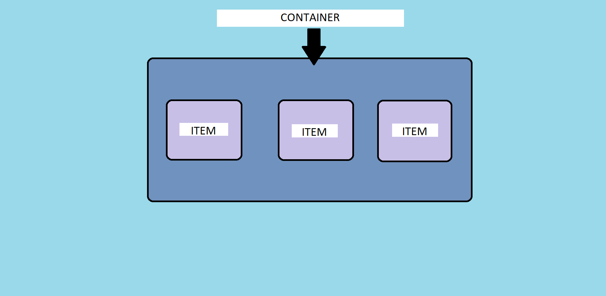

---

### Flex Direction

Flex-direction modifica el eje principal.
Es important saber cual es el eje principal para poder mover los items de forma correcta.

- Cuando esta en row o row-reverse el eje principal sera el horizontal, la fila.
- Cuando esta en column o column-reverse el eje principal sera el vertical, la columna.

> Sintaxis: ` flex-direction: row | row-reverse | column | column-reverse;`

Ejemplos:

**Código**

```HTML
<!-- HTML -->
    <div class="flex-container">
      <div class="flex-item">1 item</div>
      <div class="flex-item">2 item</div>
      <div class="flex-item">3 item</div>
      <div class="flex-item">4 item</div>
      <div class="flex-item">5 item</div>
    </div>
```

```CSS
/* CSS */
   .flex-container {
        width: 400px;
        height: 300px;
        margin: 15% auto;
        display: flex;
        gap: 5px;
        flex-direction: row;
        background-color: #937dc2;
      }

      .flex-item {
        width: 50px;
        height: 50px;
        padding: 3px;
        font-size: 20px;
      }
      .flex-item:nth-child(even) {
        background-color: #9fc9f3;
      }

      .flex-item:nth-child(odd) {
        background-color: #ff9494;
      }
```

**ROW (por defecto):**

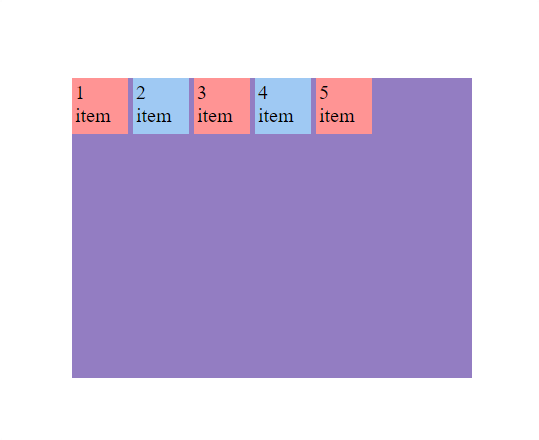

---

**ROW Reverse:**


---

**Column:**

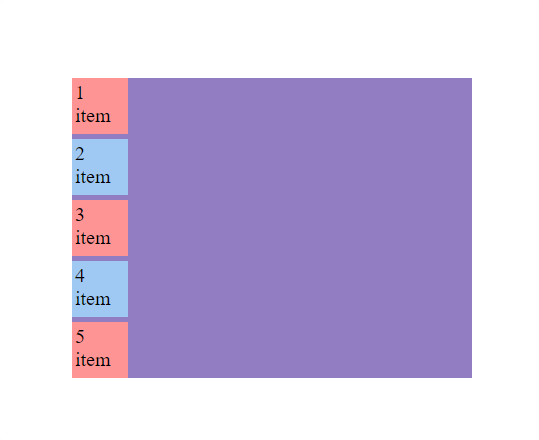

---

**Column Reverse:**

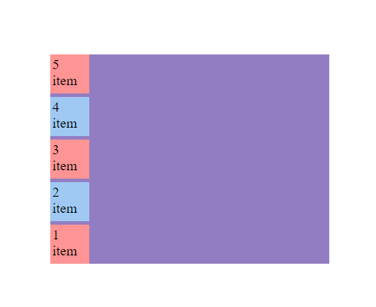

---

### Mover Horizontal y Vertical

Para mover los items es importante tener en cuenta el eje principal.

**justify-content**

Con `justify-content` movemos el **eje principal** de forma horizontal.

> Sintaxis: `justify-content: flex-start | flex-end | center | space-between | space-around | space-evenly | start | end | left | right`

Ejemplos(Eje principal Row):

**Código**

```HTML
<!-- HTML -->
    <div class="flex-container">
      <div class="flex-item">1 item</div>
      <div class="flex-item">2 item</div>
      <div class="flex-item">3 item</div>
      <div class="flex-item">4 item</div>
      <div class="flex-item">5 item</div>
    </div>
```

```CSS
/* CSS */
   .flex-container {
        width: 400px;
        height: 300px;
        margin: 15% auto;
        display: flex;
        gap: 5px;
        flex-direction: row;
        justify-content: flex-start;
        background-color: #937dc2;
      }

      .flex-item {
        width: 50px;
        height: 50px;
        padding: 3px;
        font-size: 20px;
      }
      .flex-item:nth-child(even) {
        background-color: #9fc9f3;
      }

      .flex-item:nth-child(odd) {
        background-color: #ff9494;
      }
```

**Flex-Start(por defecto)**
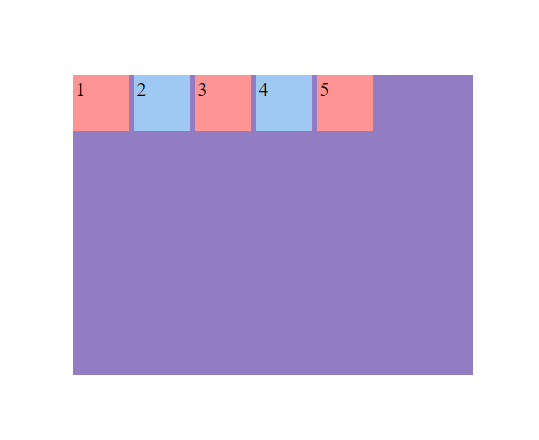

**Center**
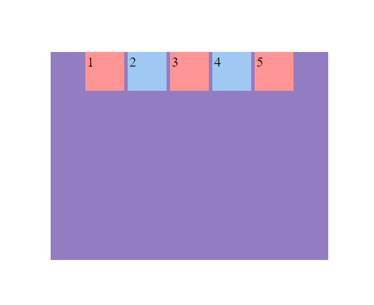

**Flex-End**
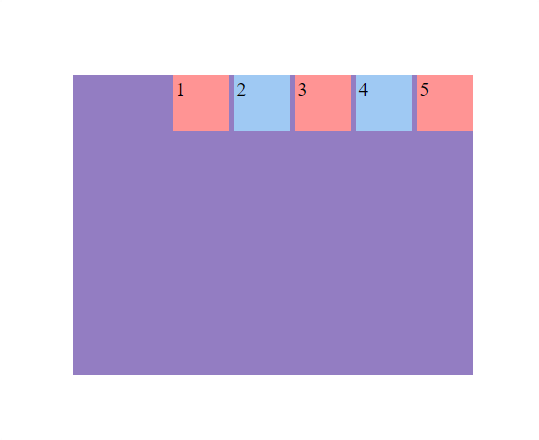

**Space-Between**
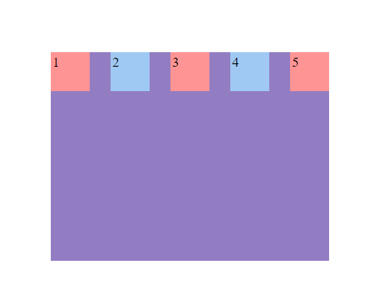

**Space-Around**
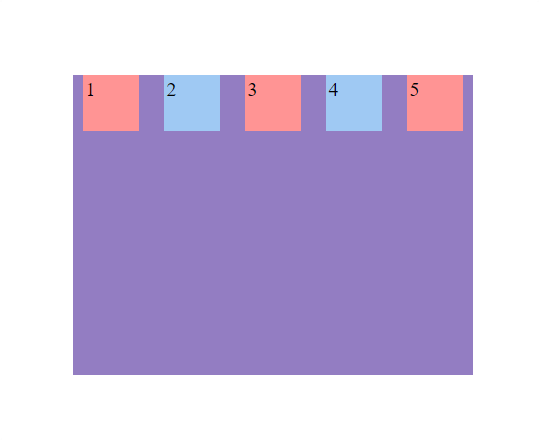

**Space-Evenly**
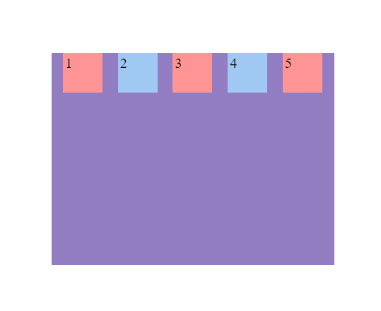

---

Ejemplos(Eje principal Column):

**Código**

```HTML
<!-- HTML -->
    <div class="flex-container">
      <div class="flex-item">1 item</div>
      <div class="flex-item">2 item</div>
      <div class="flex-item">3 item</div>
      <div class="flex-item">4 item</div>
      <div class="flex-item">5 item</div>
    </div>
```

```CSS
/* CSS */
   .flex-container {
        width: 400px;
        height: 300px;
        margin: 15% auto;
        display: flex;
        gap: 5px;
        flex-direction: column;
        justify-content: flex-start;
        background-color: #937dc2;
      }

      .flex-item {
        width: 50px;
        height: 50px;
        padding: 3px;
        font-size: 20px;
      }
      .flex-item:nth-child(even) {
        background-color: #9fc9f3;
      }

      .flex-item:nth-child(odd) {
        background-color: #ff9494;
      }
```

**Flex-Start(por defecto)**
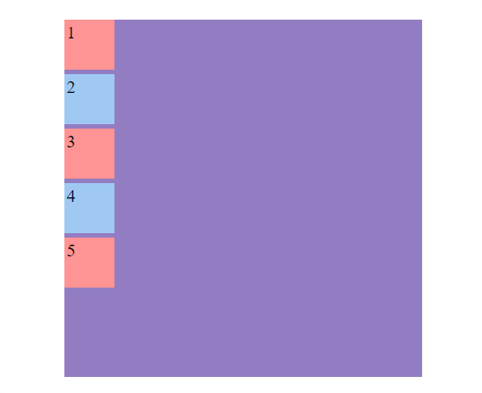

**Center**
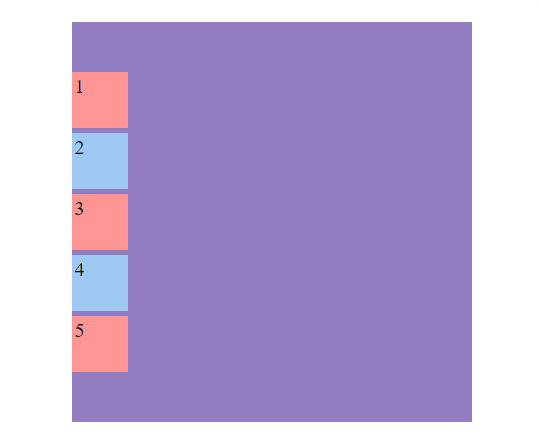

**Flex-End**
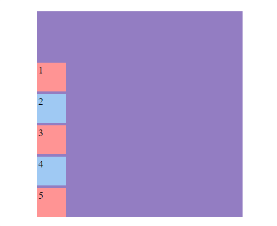

**Space-Between**


**Space-Around**
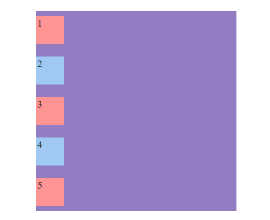

**Space-Evenly**
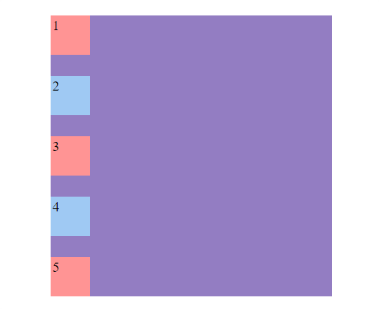

---

**align-items**

Con `align-items` movemos el **eje principal** de forma vertical.

> Sintaxis: `align-items: stretch | flex-start | flex-end | center | baseline | first baseline | last baseline | start | end;`

Ejemplos(Eje principal Row):

**Código**

```HTML
<!-- HTML -->
    <div class="flex-container">
      <div class="flex-item">1 item</div>
      <div class="flex-item">2 item</div>
      <div class="flex-item">3 item</div>
      <div class="flex-item">4 item</div>
      <div class="flex-item">5 item</div>
    </div>
```

```CSS
/* CSS */
   .flex-container {
        width: 400px;
        height: 400px;
        margin: 15% auto;
        display: flex;
        gap: 5px;
        flex-direction: row;
        align-items: flex-start;
        background-color: #937dc2;
      }

      .flex-item {
        width: 50px;
        height: 50px;
        padding: 3px;
        font-size: 20px;
      }
      .flex-item:nth-child(even) {
        background-color: #9fc9f3;
      }

      .flex-item:nth-child(odd) {
        background-color: #ff9494;
        height: 80px;
      }
```

**Flex-Start(por defecto)**
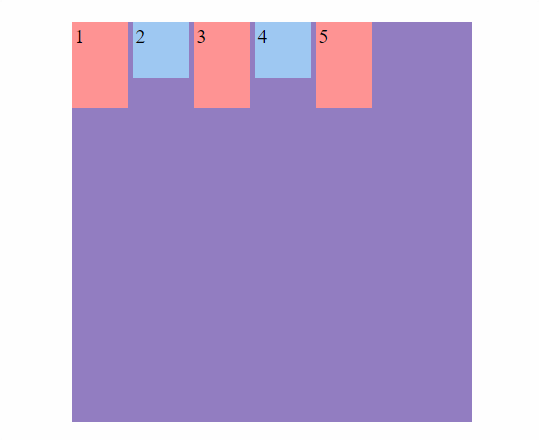

**Center**
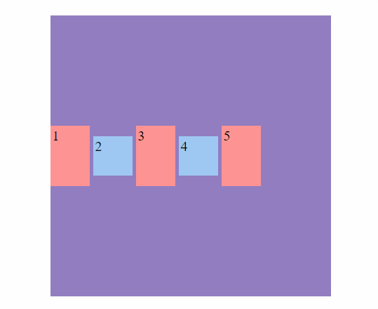

**Flex-End**
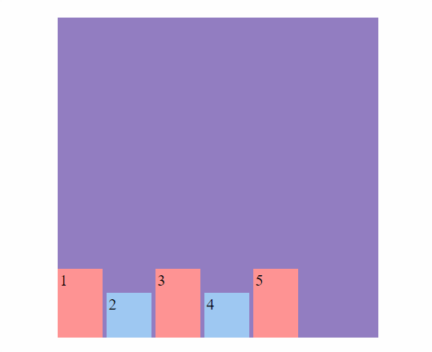

**Baseline**


**Stretch**


---

Ejemplos(Eje principal Column):

**Código**

```HTML
<!-- HTML -->
    <div class="flex-container">
      <div class="flex-item">1 item</div>
      <div class="flex-item">2 item</div>
      <div class="flex-item">3 item</div>
      <div class="flex-item">4 item</div>
      <div class="flex-item">5 item</div>
    </div>
```

```CSS
/* CSS */
   .flex-container {
        width: 400px;
        height: 400px;
        margin: 15% auto;
        display: flex;
        gap: 5px;
        flex-direction: column;
        align-items: flex-start;
        background-color: #937dc2;
      }

      .flex-item {
        width: 50px;
        height: 50px;
        padding: 3px;
        font-size: 20px;
      }
      .flex-item:nth-child(even) {
        background-color: #9fc9f3;
      }

      .flex-item:nth-child(odd) {
        background-color: #ff9494;
        width: 80px;
      }
```

**Flex-Start(por defecto)**
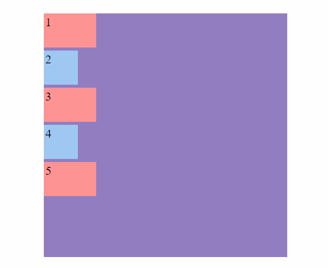

**Center**
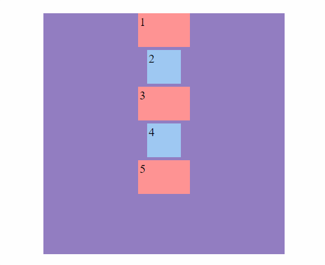

**Flex-End**
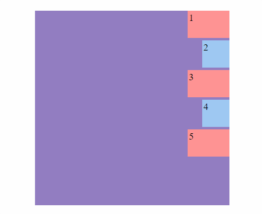

**Baseline**


**Stretch**


---

### Mover hijos individual

Con `align-self` movemos los hijos de forma individual.

> Sintaxis: `align-self: auto | flex-start | flex-end | center | baseline | stretch;`

Ejemplo:

**Código**

```HTML
<!-- HTML -->
    <div class="flex-container">
      <div class="flex-item self">1</div>
      <div class="flex-item">2</div>
      <div class="flex-item">3</div>
      <div class="flex-item self">4</div>
      <div class="flex-item">5</div>
    </div>
```

```CSS
/* CSS */
   .flex-item {
        width: 50px;
        height: 50px;
        padding: 3px;
        font-size: 20px;
      }
      .flex-item:nth-child(even) {
        background-color: #9fc9f3;
      }

      .flex-item:nth-child(odd) {
        background-color: #ff9494;
      }

      .self {
        align-self: center;
      }
```

### Modificar tamaños

En ocasiones en el layout a los hijos les sobra o falta espacio disponible. Con Flexbox podemos controlar el tamaño para ajustar mejor los items.

**Flex-grow**

Define el tamaño que crecerá un hijo, en relación a sus hermanos. Siempre que tengan espacio disponible.

Ejemplo:
**Código**

```HTML
<!-- HTML -->
    <div class="flex-container">
      <div class="flex-item grow">1</div>
      <div class="flex-item">2</div>
      <div class="flex-item">3</div>
      <div class="flex-item grow">4</div>
      <div class="flex-item">5</div>
    </div>
```

```CSS
/* CSS */
   .flex-container {
        width: 400px;
        height: 400px;
        margin: 15% auto;
        display: flex;
        gap: 5px;
        justify-content: center;
        background-color: #937dc2;
      }

      .flex-item {
        width: 50px;
        height: 50px;
        padding: 3px;
        font-size: 20px;
      }
      .flex-item:nth-child(even) {
        background-color: #9fc9f3;
      }

      .flex-item:nth-child(odd) {
        background-color: #ff9494;
      }

      .grow {
        flex-grow: 1;
      }
```

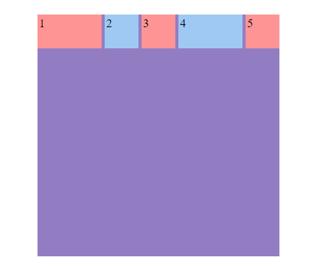

---

**Flex-shrink**

Define el tamaño que decrecerá un hijo, en relación a sus hermanos. Cuando falte espacio disponible.

Ejemplo:
**Código**

```HTML
<!-- HTML -->
   <div class="flex-container">
      <div class="flex-item shrink">1</div>
      <div class="flex-item">2</div>
      <div class="flex-item">3</div>
      <div class="flex-item shrink">4</div>
      <div class="flex-item">5</div>
    </div>
```

```CSS
/* CSS */
      .flex-container {
        width: 200px;
        height: 400px;
        margin: 15% auto;
        display: flex;
        gap: 5px;
        justify-content: center;
        background-color: #937dc2;
      }

      .flex-item {
        width: 50px;
        height: 50px;
        padding: 3px;
        font-size: 20px;
      }
      .flex-item:nth-child(even) {
        background-color: #9fc9f3;
      }

      .flex-item:nth-child(odd) {
        background-color: #ff9494;
      }

      .shrink {
        flex-shrink: 5;
      }
```

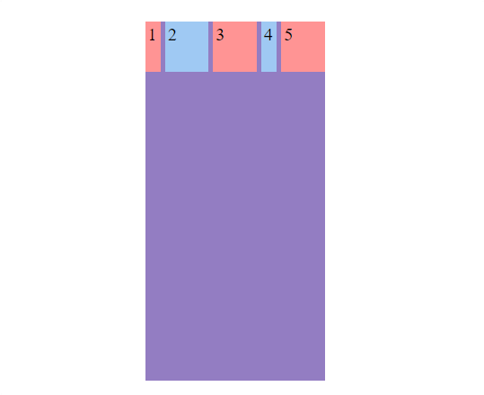

---

**Flex-basis**

Define el tamaño inicial hijo, en relación a sus hermanos. El valor por defecto es `auto`

Ejemplo:

**Código**

```HTML
<!-- HTML -->
   <div class="flex-container">
      <div class="flex-item basis">1</div>
      <div class="flex-item">2</div>
      <div class="flex-item">3</div>
      <div class="flex-item basis">4</div>
      <div class="flex-item">5</div>
    </div>
```

```CSS
/* CSS */
       .flex-container {
        width: 200px;
        height: 400px;
        margin: 15% auto;
        display: flex;
        gap: 5px;
        justify-content: center;
        background-color: #937dc2;
      }

      .flex-item {
        width: 50px;
        height: 50px;
        padding: 3px;
        font-size: 20px;
      }
      .flex-item:nth-child(even) {
        background-color: #9fc9f3;
      }

      .flex-item:nth-child(odd) {
        background-color: #ff9494;
      }

      .basis {
        flex-basis: 15px;
      }
```

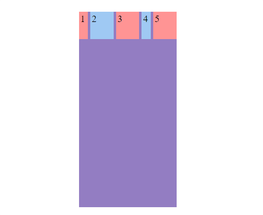

---

**Flex**

Método abreviado, combina `flex-grow, flex-shrink y flex-basis`.

Ejemplo:

**Código**

```HTML
<!-- HTML -->
   <div class="flex-container">
      <div class="flex-item flex">1</div>
      <div class="flex-item">2</div>
      <div class="flex-item">3</div>
      <div class="flex-item flex">4</div>
      <div class="flex-item">5</div>
    </div>
```

```CSS
/* CSS */
       .flex-container {
        width: 200px;
        height: 400px;
        margin: 15% auto;
        display: flex;
        gap: 5px;
        justify-content: center;
        background-color: #937dc2;
      }

      .flex-item {
        width: 50px;
        height: 50px;
        padding: 3px;
        font-size: 20px;
      }
      .flex-item:nth-child(even) {
        background-color: #9fc9f3;
      }

      .flex-item:nth-child(odd) {
        background-color: #ff9494;
      }

      .flex {
        flex: 1 1 0px;
      }
```

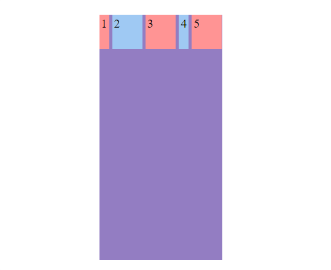

---

### Ordenar los items

Flexbox permite modificar el orden de los items mediante la propiedad `order`.

Ejemplo:

**Código**

```HTML
<!-- HTML -->
   <div class="flex-container">
      <div class="flex-item">1</div>
      <div class="flex-item">2</div>
      <div class="flex-item">3</div>
      <div class="flex-item">4</div>
      <div class="flex-item">5</div>
    </div>
```

```CSS
/* CSS */
       .flex-container {
        width: 200px;
        height: 300px;
        margin: 15% auto;
        display: flex;
        gap: 5px;
        justify-content: center;
        background-color: #937dc2;
      }

      .flex-item {
        width: 50px;
        height: 50px;
        padding: 3px;
        font-size: 20px;
      }
      .flex-item:nth-child(even) {
        background-color: #9fc9f3;
      }

      .flex-item:nth-child(odd) {
        background-color: #ff9494;
      }

      .flex-item:nth-child(1) {
        order: 3;
      }

      .flex-item:nth-child(2) {
        order: 4;
      }

      .flex-item:nth-child(3) {
        order: 1;
      }

      .flex-item:nth-child(4) {
        order: 2;
      }
```


---

### Flex-wrap

Flex-wrap especifica si los elementos hijos pueden fluir en multiples líneas o se ven obligados a mantenerse en una línea. Esta propiedad es muy util para crear un diseño web adaptable. Por defecto los items no fluyen `nowrap`.

> Sintaxis: `flex-wrap: nowrap | wrap | wrap-reverse;`

Ejemplo:

**Código**

```HTML
<!-- HTML -->
    <div class="flex-container">
      <div class="flex-item">1</div>
      <div class="flex-item">2</div>
      <div class="flex-item">3</div>
      <div class="flex-item">4</div>
      <div class="flex-item">5</div>
      <div class="flex-item">6</div>
      <div class="flex-item">7</div>
      <div class="flex-item">8</div>
      <div class="flex-item">9</div>
      <div class="flex-item">10</div>
      <div class="flex-item">11</div>
      <div class="flex-item">12</div>
      <div class="flex-item">13</div>
      <div class="flex-item">14</div>
      <div class="flex-item">15</div>
      <div class="flex-item">16</div>
      <div class="flex-item">17</div>
      <div class="flex-item">18</div>
      <div class="flex-item">19</div>
      <div class="flex-item">20</div>
      <div class="flex-item">21</div>
      <div class="flex-item">22</div>
      <div class="flex-item">23</div>
      <div class="flex-item">24</div>
      <div class="flex-item">25</div>
    </div>
```

```CSS
/* CSS */
      .flex-container {
        width: 400px;
        height: 300px;
        margin: 15% auto;
        display: flex;
        flex-wrap: nowrap;
        gap: 5px;
        background-color: #937dc2;
      }

      .flex-item {
        width: 50px;
        height: 50px;
        padding: 3px;
        font-size: 20px;
      }
      .flex-item:nth-child(even) {
        background-color: #9fc9f3;
      }

      .flex-item:nth-child(odd) {
        background-color: #ff9494;
      }
```

**nowrap**
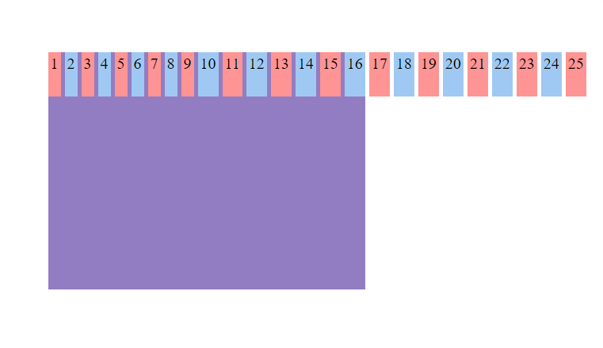

**wrap**
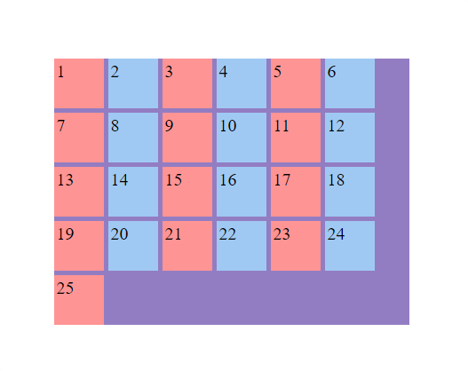

**wrap-reverse**
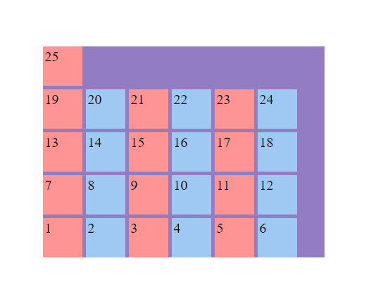

---

### Gap

Gap es la propiedad abreviada de row-gap y column-gap. Esta propiedad nos permite controlar el espacio entre elementos. El espacio no se aplica en la parte externa de los elementos.

Ejemplo:

```HTML
<!-- HTML -->
    <div class="flex-container">
      <div class="flex-item">1</div>
      <div class="flex-item">2</div>
      <div class="flex-item">3</div>
      <div class="flex-item">4</div>
      <div class="flex-item">5</div>
    </div>
```

```CSS
/* CSS */
      .flex-container {
        width: 400px;
        height: 300px;
        margin: 15% auto;
        display: flex;
        flex-wrap: nowrap;
        gap: 20px;
        background-color: #937dc2;
      }

      .flex-item {
        width: 50px;
        height: 50px;
        padding: 3px;
        font-size: 20px;
      }
      .flex-item:nth-child(even) {
        background-color: #9fc9f3;
      }

      .flex-item:nth-child(odd) {
        background-color: #ff9494;
      }
```

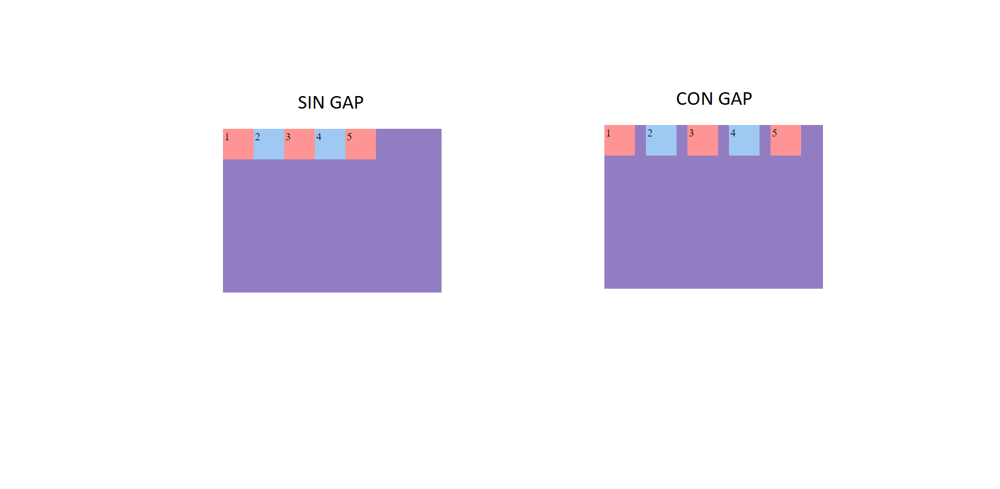

[Juego de flexbox](https://flexboxfroggy.com/#es)
