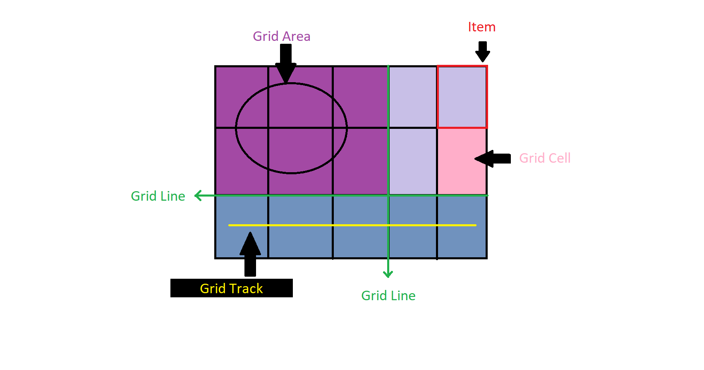
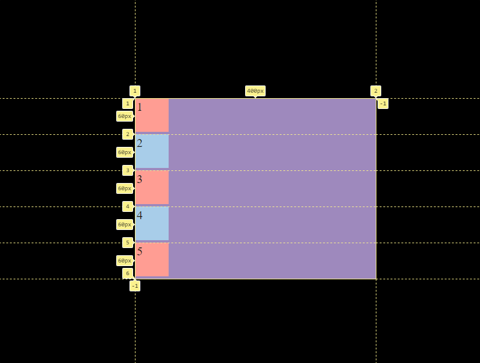
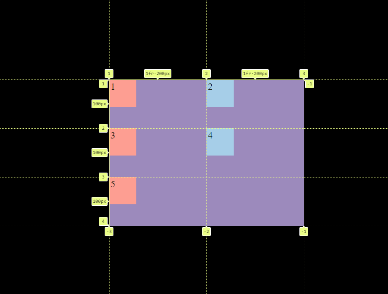
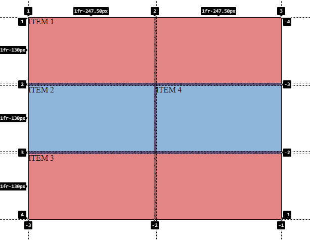
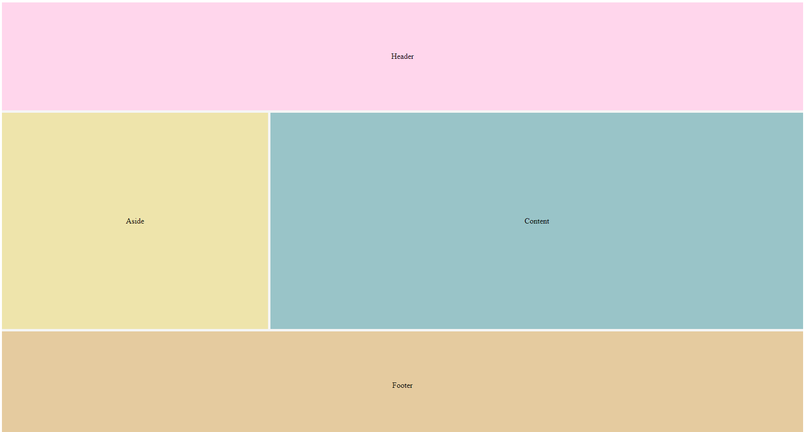
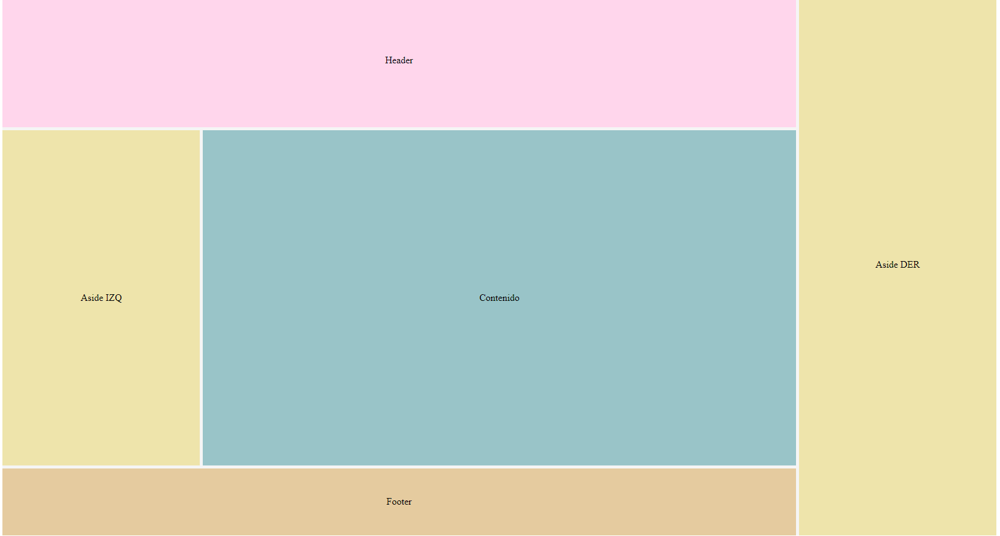
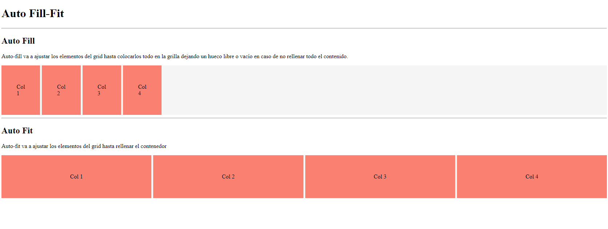
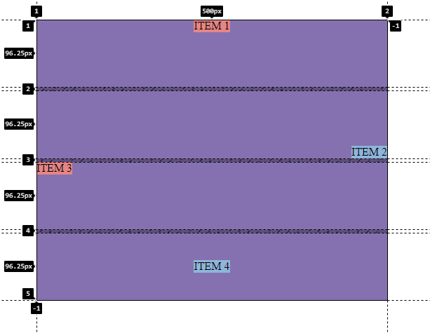

<h1 align="center">Grid<h1>
<hr>

## Contenido

- Grid
- Columnas y Filas
- Líneas por nombre
- Areas
- Auto Fill y Auto Fit

<hr>

### Grid

Grid es un modelo bidimensional para crear rejillas en varias filas y columnas al mismo tiempo. Con grid creamos cuadriculas donde colocar elementos para maquetar. No es una alternativa a Flexbox, se complementan, en algunas ocasiones usaras flexbox y en otras grid.
Grid es una buena opción para la construcción general de la página y Flexbox es alineando contenido dentro de elementos. Al aplicar el valor `grid` o `inline-grid` a la propiedad `display` los hijos directos de ese elemento se convierten en elementos grid.

**Partes importantes de Grid**

- Grid Line: Separador de celdas horizontal o vertical. Podemos hacer referencia a una GRID line por número o por nombre.
- Grid Track: Nombre genérico para un GRID row o GRID column. Es el espacio vertical u horizontal entre dos GRID lines consecutivas.
- Grid Cell: La intersección de un GRID row y un GRID column es llamada GRID cell, es decir, el espacio entre 4 GRID lines.
- Grid Area: Cualquier porción del GRID contenida entre 4 GRID lines. Puede contener N número de GRID cells.



A diferencia de flex, grid por defecto coloca los items uno debajo manteniendo el "bloque" del elemento.



---

### Columnas y Filas

Para asignar un numero de columnas o filas usaremos las propiedades `grid-template-columns` y `grid-template-rows`. Los valores que le pasaremos a estas propiedades serán lo que queremos que ocupen las columnas o filas. Si queremos 3 columnas, que la primera ocupe 150px, la segunda 300px y la tercera 150px tendríamos que hacer lo siguiente: `grid-template-columns: 150px 300px 150px`. Ademas de px también aceptan porcentajes,em,rem,cm... Prácticamente cualquier unidad de medida, una unidad que no habíamos visto hasta ahora y es muy util en grid son las fracciones(fr). Por ejemplo, si queremos 3 columnas que ocupen lo mismo, podemos utilizar `grid-template-columns: 1fr 1fr 1fr`.

Ejemplo: Grid de 3 columnas-filas iguales

```HTML
<!-- HTML -->
    <div class="grid-container">
      <div class="grid-item">1</div>
      <div class="grid-item">2</div>
      <div class="grid-item">3</div>
      <div class="grid-item">4</div>
      <div class="grid-item">5</div>
    </div>
```

```CSS
/* CSS */

     .grid-container {
        width: 400px;
        height: 300px;
        margin: 15% auto;
        display: grid;
        grid-template-columns: 1fr 1fr;
        background-color: #937dc2;
      }

      .grid-item {
        width: 50px;
        height: 50px;
        padding: 3px;
        font-size: 20px;
      }
      .grid-item:nth-child(even) {
        background-color: #9fc9f3;
      }

      .grid-item:nth-child(odd) {
        background-color: #ff9494;
      }
```



> Para evitar tener que repetir el valor de cada columna-fila podemos usar repeat(numColumnas-filas, unidad de medida).
> ` grid-template-columns: repeat(2,1fr);` El resultado es el mismo.

---

### Líneas inicio y fin

Usaremos las líneas como referencia para indicar donde empiezan y terminan las columnas y las filas. Con `grid-column-start y grid-column-end` indicaremos el inicio y el final de las columnas, para las filas usaremos `grid-row-start y grid-row-end`. Estas propiedades tienen una version abreviada, `grid-column: inicio / fin;` y `grid-row: inicio / final;`.

Ejemplo:

```HTML
<!-- HTML -->
    <div class="wrapper">
      <div class="grid-item">ITEM 1</div>
      <div class="grid-item">ITEM 2</div>
      <div class="grid-item">ITEM 3</div>
      <div class="grid-item">ITEM 4</div>
    </div>
```

```CSS
/* CSS */

     .wrapper {
        width: 500px;
        height: 400px;
        background-color: #937dc2;
        display: grid;
        grid-template-columns: 1fr 1fr;
        grid-template-rows: 1fr 1fr 1fr;
        gap: 5px;
      }
      .grid-item:nth-child(even) {
        background-color: #9fc9f3;
      }

      .grid-item:nth-child(odd) {
        background-color: #ff9494;
      }
      .grid-item:nth-child(1) {
        grid-column: 1/3;
      }
      .grid-item:nth-child(3) {
        grid-column: 1/3;
        grid-row: 3/4;
      }
```



---

### Líneas por nombre

Cuando se crean las líneas automáticamente se les asigna un numero, estos números establecen donde empiezan(Numero positivo) y terminan las lineas(Numero negativo). Sabiendo donde empiezan y terminan las líneas se pueden establecer donde empiezan y terminan.
En las propiedades `grid-template-columns` y `grid-template-rows` asignaremos los nombres y el espacio que ocuparan. Y en los items asignamos donde comienzan y lo que se expanden `span`.

Ejemplo: Layout(Header,Aside,Content,Footer)

```HTML
<!-- HTML -->
    <div class="wrapper">
      <header class="flex">Header</header>
      <aside class="flex">Aside</aside>
      <article class="flex">Content</article>
      <footer class="flex">Footer</footer>
    </div>
```

```CSS
/* CSS */

     .wrapper {
        height: 100vh;
        display: grid;
        gap: 5px; /* Igual que flex, separa los items*/
        grid-template-columns:
          [aside-start] 1fr
          [article-start] 2fr;

        grid-template-rows:
          [header-start] 1fr
          [article-start] 2fr
          [footer-start] 1fr;
      }

      header {
        background-color: #68a7ad;
        grid-column: aside-start / span 2;
      }
      aside {
        background-color: #eee4ab;
      }
      article {
        background-color: #99c4c8;
      }
      footer {
        background-color: #e5cb9f;
        grid-column: aside-start / span 2;
      }
    /* Centrar los textos */
      .flex {
        display: flex;
        justify-content: center;
        align-items: center;
      }
```



---

### Areas

Al igual que se pueden asignar nombres a las líneas también podemos asignar areas. Para asignar nombre a las areas utilizaremos la propiedad `grid-area: nombreArea;` en los items. Y para asignar las posiciones y lo que se expande cada item, lo haremos con `grid-template-areas`. Las columnas van dentro de comillas dobles "" y cada "" es una nueva fila.

```CSS
    Selector{
        grid-template-areas:
          "Columna1 Columna2 Columna3" /* Fila 1*/
          "Columna1 Columna2 Columna3" /* Fila 2*/
          "Columna1 Columna2 Columna3 "; /* Fila 3*/
    }

    /* Si queremos que el item se expanda*/

    Selector{
        grid-template-areas:
          "Item(A) Item(A)  Item(C) " /* Fila 1*/
          "Item(A)  Item(A)  Item(C) " /* Fila 2*/
          "Item(B)  Item(B)  Item(B)  "; /* Fila 3*/
    }
```

Ejemplo:

```HTML
<!-- HTML -->
    <div class="wrapper">
      <header class="flex">Header</header>
      <aside class="flex">Aside IZQ</aside>
      <article class="flex">Contenido</article>
      <aside class="flex">Aside DER</aside>
      <footer class="flex">Footer</footer>
    </div>
```

```CSS
/* CSS */
     .wrapper {
        height: 100vh;
        display: grid;
        gap: 5px;
        grid-template-columns: 1fr 3fr 1fr;
        grid-template-rows: 2fr 5fr 1fr;
        grid-template-areas:
          "header header derecha"
          "izquierda article derecha"
          "footer footer derecha ";
      }

      header {
        background-color: #FFD6EC;
        grid-area: header;
      }
      aside:first-of-type {
        background-color: #eee4ab;
        grid-area: izquierda;
      }
      article {
        background-color: #99c4c8;
        grid-area: article;
      }
      aside:last-of-type {
        background-color: #eee4ab;
        grid-area: derecha;
      }
      footer {
        background-color: #e5cb9f;
        grid-area: footer;
      }

      .flex {
        display: flex;
        justify-content: center;
        align-items: center;
      }
```



---

### Auto Fill y Auto Fit

**Auto Fill**
Auto-fill va a ajustar los elementos del grid hasta colocarlos todo en la grilla dejando un hueco libre o vacío en caso de no rellenar todo el contenido.

**Auto Fit**
Auto-fit va a ajustar los elementos del grid hasta rellenar el contenedor

Ejemplo:

```HTML
<!-- HTML -->
     <div class="wrapper autofil">
      <div class="flex">Col 1</div>
      <div class="flex">Col 2</div>
      <div class="flex">Col 3</div>
      <div class="flex">Col 4</div>
    </div>

     <div class="wrapper autofit">
      <div class="flex">Col 1</div>
      <div class="flex">Col 2</div>
      <div class="flex">Col 3</div>
      <div class="flex">Col 4</div>
    </div>
```

```CSS
/* CSS */
     .wrapper {
        display: grid;
        gap: 5px;
      }

      .wrapper div {
        background-color: salmon;
        padding: 50px;
      }

      .autofil {
        grid-template-columns: repeat(auto-fill, minmax(100px, 1fr));
      }

      .autofit {
        grid-template-columns: repeat(auto-fit, minmax(100px, 1fr));
      }

      .flex {
        display: flex;
        justify-content: center;
        align-items: center;
      }
```



> Con `minmax(valorMínimo, valorMáximo)` podemos establecer el mínimo y el máximo que queremos que ocupen las columnas-filas.

---

### Mover Items

Al igual que vimos en Flexbox, grid también permite mover los items de forma individual. Los elementos se alinean dentro de la celda, `align-self` utiliza el eje en bloque(column) y `justify-self` eje en línea(row). El método abreviado de `align-self` y `justify-self` es `place-self`. Con `place-self` podemos alinear items de manera rápida en una sola línea `place-self: center;`.

Ejemplo:

```HTML
<!-- HTML -->
     <div class="wrapper">
      <div class="grid-item">ITEM 1</div>
      <div class="grid-item">ITEM 2</div>
      <div class="grid-item">ITEM 3</div>
      <div class="grid-item">ITEM 4</div>
    </div>
```

```CSS
/* CSS */
       .wrapper {
        width: 500px;
        height: 400px;
        background-color: #937dc2;
        display: grid;
        gap: 5px;
      }
      .grid-item:nth-child(even) {
        background-color: #9fc9f3;
      }

      .grid-item:nth-child(odd) {
        background-color: #ff9494;
      }

      .grid-item:nth-child(1) {
        align-self: start;
        justify-self: center;
      }

      .grid-item:nth-child(2) {
        align-self: end;
        justify-self: end;
      }

      .grid-item:nth-child(3) {
        align-self: start;
        justify-self: start;
      }

      .grid-item:nth-child(4) {
        place-self: center;
      }
```



[Juego](https://cssgridgarden.com/#es)
