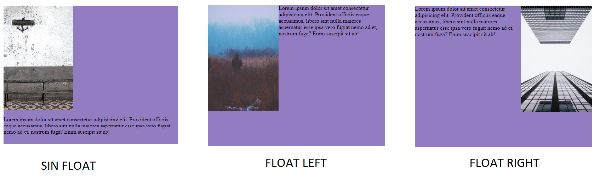

<h1 align="center">Float<h1> It pic
<hr>

### Float

La propiedad `float` hace que los elementos floten permitiendo que otros elementos se coloquen a su lado. Lo mejor que se puede hacer con esta propiedad es aprender Flexbox y Grid para evitar usarla. Lo recomendable es maquetar con flex y grid pero es necesario saber como funciona float por si te encuentras algún proyecto que lo utilice.

Ejemplo:

```HTML
<!-- HTML -->
    <div class="wrapper">
      
      <p>
        Lorem ipsum dolor sit amet consectetur adipisicing elit. Provident
        officiis eaque accusamus, libero sint nulla maiores aspernatur esse ipsa
        vero fugiat nemo ad et, nostrum fuga? Enim suscipit sit ab!
      </p>
    </div>
```

```CSS
/* CSS */

      .wrapper {
        width: 500px;
        height: 400px;
        margin: 50px auto;
        background-color: #937dc2;
      }
      img {
        float: right;
      }
```



> Como la imagen y el párrafo son elementos en bloque no permiten que otros elementos se sitúen al lado de forma horizontal. Con `float: left;` los elementos flotaran a su izquierda y con `float: right;` los elementos flotaran a su derecha.
