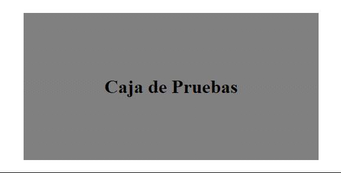

<h1 align="center">Animaciones<h1>
<hr>

## Contenido

- Introducción
- Transiciones
- Animaciones
- Transformaciones

<hr>

### Introducción

Haciendo uso de animaciones podemos resaltar elementos y mejorar la experiencia del usuario. Por ejemplo crear una animación para que el usuario sepa que se esta cargando, guardando o descargando algo y no crea que se ha quedado colgada la web.

### Transiciones

Para entender mejor las animaciones primero tenemos que ver las transiciones. Las transiciones nos permiten crear efectos entre el estado inicial y el estado final.

**Propiedades**

- transition-property: Indica las propiedades que se verán afectadas.
- transition-duration: Establece el tiempo de duración.
- transition-delay: Establece un tiempo de retardo, retardara el inicio de la transición.
- transition-timing-function: Ritmo en el que se producen los cambios durante la transición.
  - Valores(Inicio-Transcurso-Final):
    - ease lento-rápido-lento
    - linear  normal
    - ease-in lento-normal-normal
    - ease-out normal-normal-lento
    - ease-in-out lento-normal-lento

> transition: Método abreviado de las anteriores propiedades.

Ejemplo: Usando la pseudoclase(:hover) crear una transición que modifique tamaño y color.

```HTML
<!-- HTML -->

    <div class="wrapper">
      <h1>Caja de Pruebas</h1>
    </div>
```

```CSS
/* CSS */

      .wrapper {
        width: 500px;
        height: 250px;
        margin: 200px auto;
        display: flex;
        justify-content: center;
        align-items: center;
        background-color: grey;
      }
      .wrapper:hover {
        width: 200px;
        height: 150px;
        font-size: 10px;
        color: palegreen;
        background-color: papayawhip;

        transition-property: all;
        transition-duration: 1.5s;
        transition-timing-function: linear;
      }
```



> Con la propiedad abreviada: `transition: all 1.5s linear;`

---

### Animaciones

Con las animaciones podemos añadir más estados a las transiciones. Las animaciones se componen de 2 partes principales, `animation` para indicar el elemento que queremos animar y `@keyframe` para definir el comportamiento.

**Propiedades de animation**

- animation-name: Establece un nombre a la animación.
- animation-duration: Establece el tiempo de duración.
- animation-iteration-count: Número de veces que se repetirá la animación.
- animation-direction: Dirección de la animación.
- animation-play-state: Estado de la animación, para indicar si esta pausado o no
- animation-fill-mode: Establece como quedara la animación al acabar.
- animation-delay: Establece un tiempo de retardo, retardara el inicio de la transición.
- animation: Propiedad abreviada.

**Regla Keyframe**

Sintaxis:

```CSS
  @keyframe nombre-de-la-animación{
    selector{/*Palabra-Clave o Porcentaje*/
      propiedad:valor;
    }
  }
```

> Para el selector podemos usar `from` y `to` o un porcentaje del 0% al 100%. Con el selector indicamos en que parte se aplicaran las propiedades de la animación.

Ejemplo: Ampliar tamaño texto usando(from-to)

```HTML
 <!-- HTML -->
    <div class="wrapper">
      <h1>Caja de Pruebas</h1>
    </div>
```

```CSS
 /* CSS */
      .wrapper {
        width: 500px;
        height: 250px;
        margin: 200px auto;
        display: flex;
        justify-content: center;
        align-items: center;
        background-color: grey;

        animation-name: ampliar-tamaño;
        animation-duration: 2s;
        animation-iteration-count: 4;
      }

      @keyframes ampliar-tamaño {
        from {
          font-size: 10px;
        }

        to {
          font-size: 20px;
        }
      }
```


Ejemplo: Ampliar ancho caja usando(porcentajes)

```HTML
 <!-- HTML -->
    <div class="wrapper">
      <h1>Caja de Pruebas</h1>
    </div>
```

```CSS
 /* CSS */
      .wrapper {
        width: 500px;
        height: 250px;
        margin: 200px auto;
        display: flex;
        justify-content: center;
        align-items: center;
        background-color: grey;

        animation-name: mover-caja;
        animation-duration: 5s;
        animation-iteration-count: 4;
      }

      @keyframes mover-caja {
        0%{
          width: 500px;
        }
        25%{
          width: 600px;
        }
        50%{
          width: 700px;
        }
        75%{
          width: 800px;
        }
        100%{
          width: 900px;
        }
      }
```


---

### Transformaciones

Las trasformaciones `transform` nos permiten nos permiten modificar el espacio de coordenadas. Con esta propiedad podemos hacer que los elementos roten, sean escalados o sesgados.

## **Valores de la propiedad `transform`(2d)**

-translate(): Mover elementos en el ejeX(horizontal) y/o ejeY(vertical).
-scale(): Escala el elemento haciéndolo más grande o pequeño.
-rotate(): Gira los elementos en el ejeX(horizontal) y/o ejeY(vertical).
-skewX() y skewY(): Deforma/inclina el elemento sobre su eje.

Ejemplos:

```HTML
 <!-- HTML -->
     <div class="wrapper">
      <div class="caja">Scale(1.5)</div>
      <div class="caja">Rotate(90deg)</div>
      <div class="caja">SkewX(30deg)</div>
      <div class="caja">Translate(20px, 45px)</div>
    </div>
```

```CSS
 /* CSS */
      .wrapper {
        width: 800px;
        height: 250px;
        margin: 200px auto;
        background-color: teal;
        display: flex;
        justify-content: space-around;
        align-items: center;
      }

      .caja {
        display: flex;
        justify-content: center;
        align-items: center;
      }

      .caja:nth-child(odd) {
        width: 150px;
        height: 150px;
        background-color: palegreen;
      }

      .caja:nth-child(even) {
        width: 150px;
        height: 150px;
        background-color: palevioletred;
      }

      .caja:nth-child(1):hover {
        transform: scale(1.5);
      }

      .caja:nth-child(2):hover {
        transform: rotate(90deg);
      }

      .caja:nth-child(3):hover {
        transform: skewX(30deg);
      }

      .caja:nth-child(4):hover {
        transform: translate(20px, 45px);
      }
```


---
