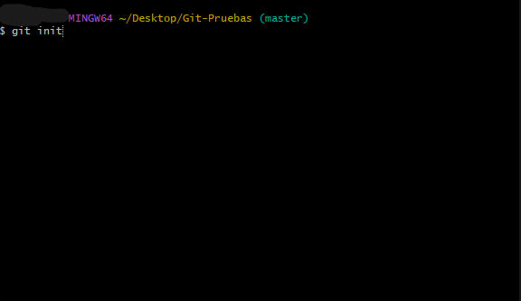
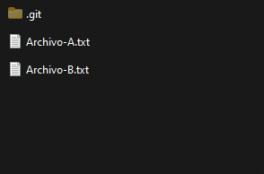
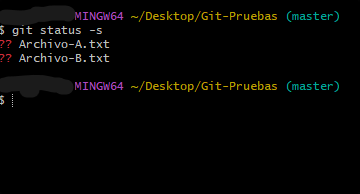
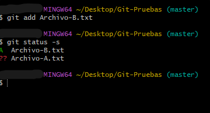
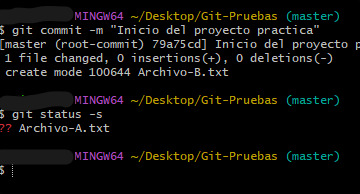
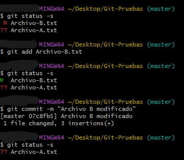
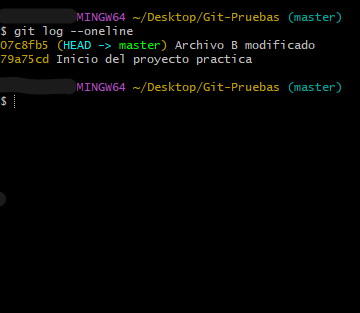
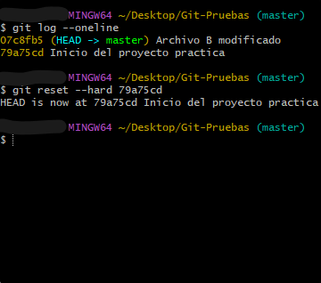

<h1 align="center">Repositorios</h1>

### Contenido

- Repositorios
- Subir a Github
- Clonar de Github
- Practica
- Tags
- Github bonus

**Repositorios**
Un repositorio contiene todos los archivos de su proyecto, el historial de revisión y la información añadida de los colaboradores. Cuando subimos un repositorio a Github este puede se publico(Cualquiera puede verlo) o privado(Tu eliges quien lo ve).

Comandos(desde el directorio de trabajo):

- **git init:** Solo se utiliza una vez, lo utilizaremos para la configuración inicial de un repositorio nuevo. Git crea dos areas donde almacena los archivos, el área repositorio local y el área de ensayo. El área de ensayo es un area temporal, donde veremos los estados de los archivos. Y el área del repositorio local donde se almacenan las instantáneas/copias que guarda Git. Los archivos git están ocultos, habilita la opción de elementos ocultos del explorador de archivos para visualizarlos.

- **git add nombreArchivo:** Indica a Git los archivos que queremos hacer un seguimiento. Internamente mueve los archivos que le especifiquemos al área de ensayo. Con el comando `git status` podemos saber los archivos y directorios que se encuentran en seguimiento. Con `git add .` o `git add -A` añadimos todos los archivos del repositorio.

  - Si aparece ?? delante del archivo significa que no están en seguimiento.
  - Si aparece una A es que el archivo esta agregado.
  - Si aparece una M(rojo) es que el archivo modificado no esta en seguimiento.
  - Si aparece una M(verde) es que el archivo modificado esta en seguimiento.

- **git commit:** Al realizar el `git commit`, Git mueve los archivos del área de ensayo al área repositorio local. En ese momento es cuando crea la instantánea y ya tendríamos un respaldo de esos archivos.
  - **git commit -m "mensaje descriptivo":** Con la bandera -m, agregamos un mensaje a la instantánea. Este mensaje nos ayudara a identificar en que punto del proyecto esta guardado o que parte acabamos de añadir.

> Una vez realizado el "commit" podemos ver cuantas instantáneas-copias tenemos realizadas con el comando `git log --oneline`. Aparecerán las instantáneas con sus respectivos mensajes que hayamos agregado.

**Restaurar**
Para restaurar hay que tener en cuenta el código de la instantánea. El código aparece en amarillo cuando utilizamos el comando `git log --oneline`.
Para restaurar una version concreta usaremos `git reset --hard CódigoInstantánea`.
**Importante** Al volver atrás las instantáneas-copias posteriores se borran.

**Modificar el último commit**
Para modificar el último commit utilizaremos `git commit --amend -m "mensaje nuevo del commit"`.

**Descargar Cambios**
Si estamos trabajando en equipo, en varios ordenadores distintos o hemos editado algo desde el editor de Github, necesitaremos bajar esos cambios a nuestro repositorio local. Para bajar esos cambios usaremos el comando `git pull`. Antes de hacer un pull puedes hacer un `git fetch` para saber los cambios hechos en remoto desde el último
`pull`.

---

### Subir repositorio local a Github

En tu perfil de Github tienes que crear un nuevo repositorio.
Es necesario tener los archivos en un área local(init,add,commit realizados).

**Comando**
`git remote add origin http://UrlDeTuProyecto.git`
Al crear el repositorio aparece una URL, esa URL es la que tienes que poner.

---

### Clonar repositorio Github

Si perdemos la información que tenemos en local o necesitamos acceder a ella desde otra ubicación podemos clonar el repositorio con todo lo que tengamos guardado en Github. La URL del proyecto se encuentra en code>clone>https.

> Comando para clonar `git clone URL/HTTPS/Del/Proyecto`

### Resumen

**Inicializar y subir repositorio**

Creamos una carpeta para el proyecto.
Botón derecho sobre la carpeta, abrir con Git Bash.
**git init**(Inicializar repositorio)
**git add .** (Agregamos todos los archivos)
**git commit -m "mensaje del commit"** (Crear instantáneas-copia)
**git remote add origin https://github.com/Usuario/proyecto.git** (Crea un nuevo control remoto llamado origin)
**git push -u origin main** (Sube las confirmaciones en la rama local llamada master(main o master) al remoto llamado origin)

**Clonar repositorio**

---

### Practica:

**Realiza la configuración de un repositorio Git**
Agrega solo el Archivo-B.txt.
Modifica el archivo y crea una nueva instantánea-copia.
Ver cuantas instantáneas existen(2).
Vuelve a una version anterior.

Habilita la opción de elementos ocultos del explorador de archivos para tener un feedback.

Arquitectura de directorios.

- Git-Pruebas
  - Archivo-A.txt
  - Archivo-B.txt

**Solución**
Abrimos la Git Bash, en el directorio de trabajo(Git-Pruebas).
Botón derecho sobre Git-Pruebas abrir Git Bash.

> Inicializar configuración(init)
> 

> Crea la siguiente capeta
> 

> Mirar seguimiento de los archivos(status)
> 

> Agregar seguimiento archivos(add)
> 

> Crear instantánea-copia(commit)
> 

> Escribimos en el archivo cualquier cosa.
> Añadimos de nuevo el archivo y creamos una nueva instancia.
> 

> Ver numero de instantáneas-copias
> 

> Restaurar instantáneas-copias
> 

> Si abres el Archivo-B.txt veras que esta vació, como en la primera copia que hicimos.

---

### Tags

Las tags(etiquetas) nos sirven para guardar una instantánea del repositorio que se mantendrá inalterable. Es decir, si queremos guardar una version del proyecto usaremos un tag. Con los tags podemos tener varias versiones del proyecto guardadas y seguir trabajando en el.

> Comandos
> Crear la etiqueta/tag: `git tag nombreIdentificativo -m"mensaje de descripción"`
> Subir la etiqueta/tag: `git push --tags`

### Github bonus

Al crear un nuevo repositorio en Github aparte de lo que acabamos de ver aparecen varias opciones extras. Estas opciones no son requeridas pero si muy útiles, el archivo README, el gitignore y la licencia.

**README**
El archivo README.md es un archivo de Markdown(Markdown es un lenguaje de marcado) que se utiliza para escribir una descripción del proyecto.

**.Gitignore**
Es un archivo de texto que le dice a Git qué archivos o carpetas ignorar en un proyecto. Los archivos que decidas ignorar no se borran del repositorio local, simplemente los ignora y no les proporcionara un seguimiento. Dentro del archivo .gitignore bastaría con añadir el nombre de la carpeta o archivo.

**Licencia**
En la opción de la licencia podemos definir lo que pueden y lo que no pueden hacer otros con tu repositorio.
