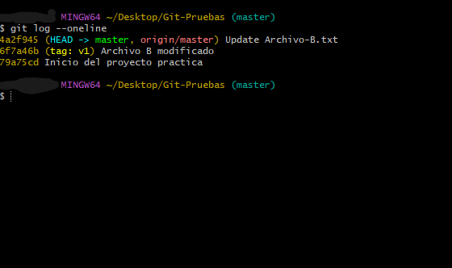

<h1 align="center">Ramas</h1>

### Contenido

- Branches(Ramas)
- Unir ramas
- Practica?????

### Branches(Ramas)

Las ramas son una línea independiente de desarrollo. Cuando creamos una rama Git establece una bifurcación del estado del código para crear un nuevo camino donde almacenar instantáneas(commits). A lo largo de un proyecto se van creando varias instantáneas estas crean una línea de tiempo que por defecto se le llama rama master. Las ramas son muy útiles para añadir nuevas funcionalidades experimentales. Si tenemos un proyecto estable y queremos probar nuevas funciones, podemos crear una nueva rama para evitar que la rama principal se vea afectada. Con una buena planificación usando ramas podemos evitar tener que restaurar(`git reset`) instantáneas en la rama principal. Se suele crear una rama `master o main `donde solamente se encuentra el código funcional y otra ´dev´ donde se trabaja.

Con `$ git log --oneline` podemos saber en que rama nos encontramos.

> El HEAD apunta a la rama en la que estamos situados.

**Trabajo en equipo**

Cuando varias personas trabajan en un mismo proyecto, cada trabajador crea su propia rama para evitar mezclar su trabajo y trabajar en un entorno seguro. Una vez realizado los cambios y comprobado que no hay errores se envían a la rama principal.

**Comandos**

**Crear Ramas**

> ` git branch nombreDeLaRama`

**Ver Ramas**

> `git branch`

> `git branch --list`

**Moverse a otras Ramas**

> `git checkout nombreDeLaRama`

**Cambiar nombre Ramas**

> `git branch -m nombreAntiguo nuevoNombreDeLaRama`

O

> `git checkout nombreDeLaRama`

> `git branch -m nuevoNombreDeLaRama`

**Eliminar Ramas repositorio local**

> `git branch -d nombre_rama`

Si la rama tiene trabajo sin fusionar saltara un error, podemos forzar la eliminación con `git branch -D nombre_rama`

**Eliminar Ramas repositorio remoto**

> `git push origin :nombreDeLaRama`

### Unir ramas(merge)

Una vez comprobado que todo funciona toca unir las ramas. Este proceso se le llama merge(unir) y puede generar conflictos. Al modificar los mismos archivos en diferentes ramas es probable que cambiemos código de la rama principal, pues a la hora de unir las ramas Git te indicara que hay un conflicto de concurrencia. Este conflicto surge por modificar lo mismo del mismo archivo. En este caso tendremos que indicar con que código nos queremos quedar.

> El merge se debe hacer desde la rama principal.

**Comandos**

**Unir Ramas**

> `git merge nombreDeLaRama`
